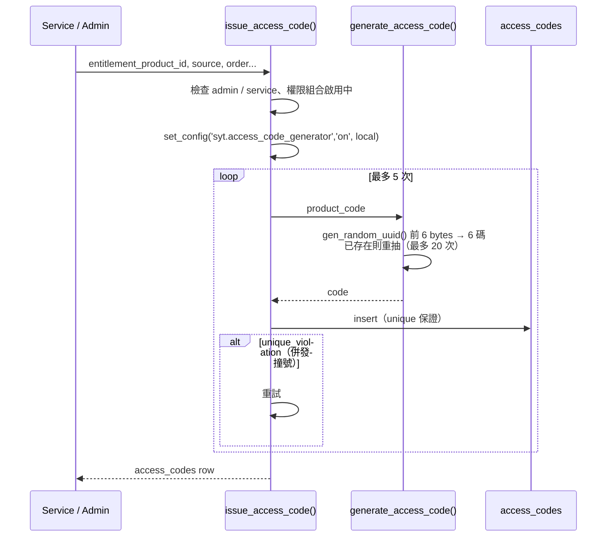
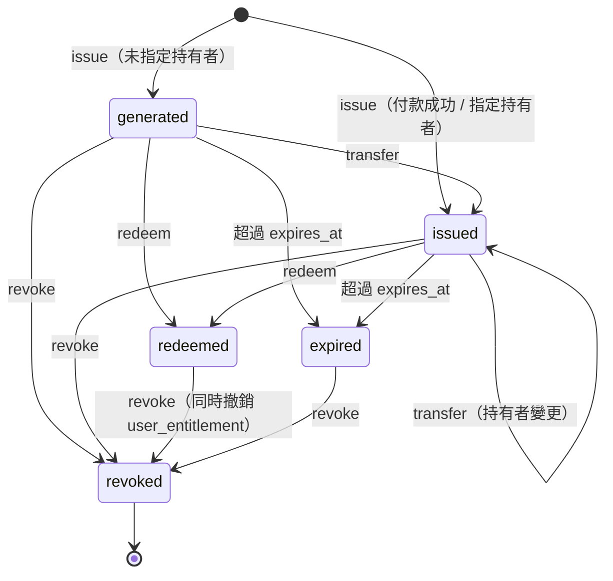
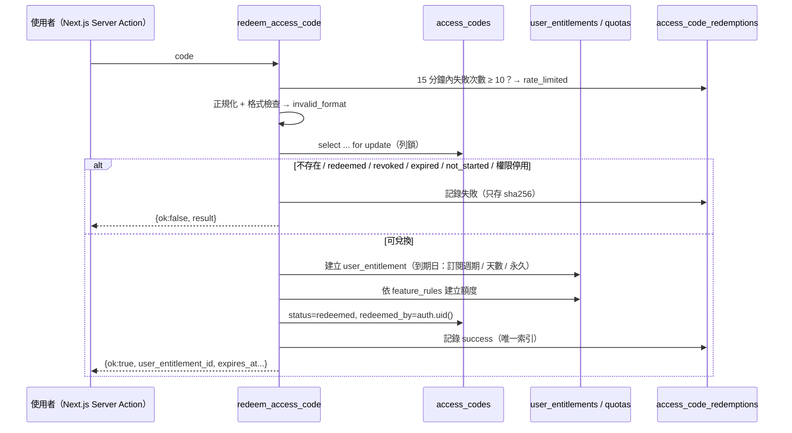

# 權限代碼（Access Code）規格 v2.0

## 1. 規則摘要

| 規則 | 實作 |
|---|---|
| 系統自動產生，不得人工編碼 | `generate_access_code()` / `issue_access_code()`；直接 insert 會被 `guard_access_code_insert` 拒絕 |
| 付款成功或後台標記付款成功後自動生成 | `mark_payment_success_and_issue_entitlement(order_id)` |
| 每組代碼對應不同功能權限 | `access_codes.entitlement_product_id` → `entitlement_feature_rules` |
| 明顯辨識度 | `SYT-{產品代碼}-{年份}-{6 碼}` |
| 未啟用前可轉讓 | `transfer_access_code(code, recipient_email)`（狀態 generated / issued） |
| 啟用後綁定第一個使用者 | `redeemed_by_user_id`、`redeemed_at`，之後不可改 |
| 一組代碼只能啟用一次 | 列鎖 + 狀態檢查 + `uq_access_code_redemptions_one_success` 唯一索引 + `user_entitlements.access_code_id unique` |
| 可設定期限 | `starts_at`（可兌換起始）、`expires_at`（兌換期限）；權限到期另由 `entitlement_duration_days` / 方案 / 訂閱決定 |
| 狀態 | generated、issued、redeemed、expired、revoked |

---

## 2. 格式

```txt
SYT-SEO-2026-A8K3Q9
│   │   │    └─ 6 碼隨機字元
│   │   └────── 發放年份（Asia/Taipei）
│   └────────── 產品代碼
└────────────── 森映固定前綴
```

| 產品代碼 | 權限 | 預設 entitlement_key |
|---|---|---|
| `SEO` | SEO 形象官網 | `seo_website_v1` |
| `LP` | 一頁式網頁 | `landing_page_v1` |
| `ECOM` | 電商網站（客製） | `ecommerce_custom` |
| `DM` | 活動 DM / 宣傳頁 | `dm_page_v1` |
| `AI` | SEO 文章生產器 | `ai_article_generator` |
| `CUSTOM` | 客製專案 | `custom_project` |

**字元集（32 字）**：`ABCDEFGHJKMNPQRSTUVWXYZ123456789`

- 移除 `I`、`L`、`O`、`0`，避免 1 / I / L、0 / O 看錯。
- 32 = 2⁵，每個字元取隨機 byte 的低 5 bits，沒有取模偏差。
- 每個產品、每年有 32⁶ ≈ 10.7 億種組合。

**資料庫 CHECK**

```sql
code ~ '^SYT-(SEO|LP|ECOM|DM|AI|CUSTOM)-[0-9]{4}-[A-HJKMNP-Z1-9]{6}$'
split_part(code, '-', 2) = product_code
split_part(code, '-', 3)::int = code_year
```

輸入時會正規化：轉大寫、移除空白與底線（`normalize_access_code()`），所以 `syt-seo-2026-a8k3q9` 也能兌換。

---

## 3. 產生與唯一性



- `generate_access_code` 會查表避開已存在代碼；真正的唯一性由 `access_codes.code unique` 保證，`issue_access_code` 遇到 `unique_violation` 自動重試。
- `generate_access_code` 只允許 admin / service 呼叫，避免被當成「代碼是否存在」的探測工具。
- 狀態：指定持有者（user 或 email）時為 `issued`，否則為 `generated`。
- `expires_at` 預設 = 發放時間 + `entitlement_products.code_valid_days`。

---

## 4. 生命週期



| 轉換 | 誰 | 方式 |
|---|---|---|
| → issued / generated | service / admin | `issue_access_code`、`mark_payment_success_and_issue_entitlement` |
| issued → issued（轉讓） | 持有者 / admin | `transfer_access_code` |
| → redeemed | 任何登入者（持有代碼字串） | `redeem_access_code`、`create_workspace_from_access_code` |
| → expired | 排程 / 兌換時發現過期 | `run_entitlement_expiry_job`、兌換函式 |
| → revoked | owner / admin | `revoke_access_code` 或直接 update status（guard 只允許改成 revoked） |

---

## 5. 轉讓（未兌換前）

`transfer_access_code(code, recipient_email)`

1. 必須登入；鎖定代碼列。
2. 呼叫者必須是目前持有者（或森映 admin）；不是持有者一律回「access code not found」，不透露代碼是否存在。
3. 狀態必須是 generated / issued，未過期，權限組合 `is_transferable_before_redeem = true`。
4. 受讓人必須已註冊（以 email 查 `auth.users`），不可轉給自己。
5. 更新 `issued_to_user_id`、`issued_to_email`、`transfer_count`，寫入 `access_code_transfers` 與 audit log。

> 代碼本身是 bearer token：知道字串的人就能兌換。「轉讓」的意義是讓代碼出現在受讓人的後台清單，並留下紀錄。付款後寄送代碼的 email 需提醒買家妥善保管。

---

## 6. 兌換（交易安全）

`redeem_access_code(code) → jsonb`



**併發**：兩個人同時兌換同一組代碼時，第二個交易會在 `for update` 等待；第一個 commit 後，第二個讀到 `redeemed`，回傳 `already_redeemed`。即使程式被改壞，`uq_access_code_redemptions_one_success` 與 `user_entitlements.access_code_id unique` 也會擋下第二筆。

**失敗不丟例外**：業務失敗以回傳值表示，失敗紀錄會 commit，才能做暴力猜測限制。

| result | 意義 |
|---|---|
| `success` | 兌換成功 |
| `invalid_format` | 格式不符 |
| `not_found` | 查無代碼 |
| `already_redeemed` | 已被兌換 |
| `revoked` | 已撤銷 |
| `expired` | 超過兌換期限，或訂閱已失效 |
| `not_started` | 尚未到可兌換時間 |
| `inactive_product` | 權限組合已停用 |
| `rate_limited` | 15 分鐘內失敗 10 次 |

**權限到期日**

| 情況 | `user_entitlements.expires_at` |
|---|---|
| 訂閱代碼（`customer_subscription_id` 有值） | 訂閱 `current_period_end`；續訂時由 `record_subscription_renewal` 延長 |
| `access_codes.entitlement_duration_days` 有值 | 兌換時間 + 天數 |
| `entitlement_products.default_duration_days` 有值 | 兌換時間 + 天數 |
| 都沒有 | null（永久） |

---

## 7. 兌換並建立 Workspace

`create_workspace_from_access_code(code, workspace_name default null) → jsonb`

1. 代碼已由本人兌換且已有 workspace → 回傳 `already_exists`（冪等）。
2. 代碼已由本人兌換但沒有 workspace → 直接建立。
3. 其他情況 → 先走兌換流程，失敗就回傳兌換結果。
4. 建立 `customer_workspaces`（owner = 兌換者）、owner 成員、`customer_workspace_settings`。
5. 把 workspace_id 回寫到 `user_entitlements`、`access_codes.redeemed_workspace_id`、兌換紀錄、訂閱。

第一版：每組 SEO / LP 代碼的 `site.create` 額度 = 1，所以「每次購買只開 1 個網站」。第二版在方案規則調高 `quota_amount` 即可支援多網站，不需改 schema。

---

## 8. 撤銷

`revoke_access_code(code, reason)`（admin / service）

- 已兌換的代碼撤銷時，同步把對應 `user_entitlements` 設為 `revoked`。
- 退款流程（`commerce_refunds.revoke_entitlements = true`）應呼叫此函式。

---

## 9. Next.js 呼叫範例

```ts
// app/(customer)/redeem/actions.ts — Server Action
'use server';
import { z } from 'zod';
import { createServerClient } from '@/lib/supabase/server';

const Schema = z.object({ code: z.string().trim().min(10).max(40) });

export async function redeemAndCreateWorkspace(formData: FormData) {
  const { code } = Schema.parse({ code: formData.get('code') });
  const supabase = await createServerClient();          // 使用者 session，不是 service role
  const { data, error } = await supabase.rpc('create_workspace_from_access_code', { code });
  if (error) throw error;
  if (!data.ok) return { ok: false, reason: data.result }; // already_redeemed / expired / rate_limited ...
  return { ok: true, workspaceId: data.workspace_id };
}
```

```ts
// Edge Function（service role）— 綠界付款成功通知驗證 CheckMacValue 後
await supabaseAdmin.rpc('mark_payment_success_and_issue_entitlement', {
  order_id: orderId,
  payment_id: paymentId,
  provider_trade_no: payload.TradeNo,
});
```

---

## 10. 前端顯示建議

- 列表只顯示部分代碼：`SYT-SEO-2026-A8K•••`，點擊「顯示」才顯示完整字串。
- 兌換頁錯誤訊息：`already_redeemed`、`not_found` 對一般使用者可統一顯示「代碼無效或已使用」，避免協助猜測。
- `rate_limited`：顯示「嘗試次數過多，請 15 分鐘後再試」。
