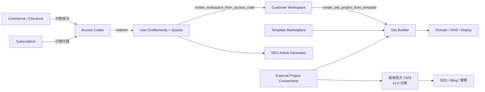

# 森映 Headless 自助建站電商平台 DB 規格 v2.0

> 基底：`森映品牌官網_DB_SQL_v1.0`（CMS 與 SEO 規劃 v1.0、整體架構設計 v1.0）
> 資料庫：Supabase Postgres 17；共 **110 張 public 資料表**（v1.0 27 張 + v2.0 83 張）

---

## 1. 模組總覽

| 模組 | Migration | 資料表數 | 重點 |
|---|---|---:|---|
| 森映官方 CMS（v1.0） | 0002 | 28 | 沿用 v1.0，新增 `customer_profiles`、audit_logs 欄位 |
| Commerce / Checkout | 0003 | 14 | 金流啟用 / 停用、secret reference、Webhook 原始資料 |
| Subscription | 0004 | 7 | 月繳 / 年繳 / 一次性、週期、帳單、取消 |
| Entitlements / Access Codes | 0004 | 9 | 自動產生代碼、轉讓、交易安全兌換、額度 |
| Customer Workspaces | 0005 | 4 | owner / admin / editor / viewer |
| Customer Site Builder | 0006 | 16 | 模板制、draft / published、SEO 欄位 |
| Template Marketplace | 0007 | 12 | 免費 / 付費 / 方案限定 / 私人 |
| Domain / DNS / Deployment | 0008 | 8 | DNS 指示、驗證、SSL、部署紀錄 |
| SEO Article Generator | 0009 | 9 | 品牌、關鍵字、輸出、匯出、額度、審核 |
| External Project Connections | 0010 | 3 | 既有網站接入盤點 |

---

## 2. 命名與欄位規範

| 規則 | 說明 |
|---|---|
| 命名 | snake_case；資料表複數；模組前綴（`commerce_`、`subscription_`、`entitlement_`、`customer_site_`、`site_template_`、`site_`、`ai_article_`、`external_project_`） |
| 主鍵 | `id uuid primary key default gen_random_uuid()`；v1.0 沿用 `admin_profiles.user_id`、`audit_logs.id bigint`、`conversion_events.id bigint`；join table 使用複合主鍵 |
| 時間 | **所有表都有 `created_at timestamptz`**；非 append-only 表都有 `updated_at`，由 0011 自動掛 `set_updated_at` trigger |
| 操作者 | 重要表有 `created_by` / `updated_by uuid references auth.users(id) on delete set null` |
| slug / key | `citext` + 格式 CHECK：slug `^[a-z0-9]+(?:-[a-z0-9]+)*$`、key `^[a-z0-9_]+$` |
| 金額 | `*_cents bigint`（沿用 v1.0 `starting_price_cents`）；`currency char(3)` 預設 `TWD`；TWD 金額必須是整數元（`amount_cents % 100 = 0`，綠界 TotalAmount 為整數） |
| 狀態 | 以 enum 表示（見 §4）；有 `published` 狀態的表都有 `check (status <> 'published' or published_at is not null)` |
| JSON | `jsonb`，形狀以 CHECK 保護（array / object），內容由應用層 Zod 驗證；敏感設定用 `jsonb_has_secret_like_keys()` CHECK 擋下 |
| 密鑰 | 不存值，只存 reference：`secret_refs jsonb`，值必須符合 `^(vault|env):[A-Za-z0-9_./-]+$` |
| 刪除 | 內容與交易資料以狀態（archived / revoked / removed / cancelled）取代刪除；join / 子資料 `on delete cascade`；交易關聯 `on delete restrict` |
| 外鍵索引 | 0011 以迴圈替 **所有外鍵** 自動補索引，`schema_smoke_test` 驗證無遺漏 |

### Append-only 資料表（只有 `created_at`）

`audit_logs`、`conversion_events`、`commerce_payment_transactions`、`access_code_redemptions`、`access_code_transfers`、`entitlement_usage_events`、`site_domain_check_logs`、`ai_article_usage_events`、`ai_article_review_logs`，以及 join table（`blog_post_tags`、`case_assets`、`case_services`、`case_products`、`site_template_category_links`）。

API 端不可修改 / 刪除（`guard_append_only`、`guard_audit_log_mutation`）；外鍵 `on delete set null / cascade` 仍可運作。

---

## 3. 資料表清單

### 3.1 森映官方 CMS（0002，v1.0 沿用）

| 資料表 | 說明 | v2.0 變更 |
|---|---|---|
| `admin_profiles` | 後台帳號與角色 | guard 強化（見 RLS_SPEC_v2） |
| `cms_site_settings` | 站點 / 平台設定（`platform.*` 為 v2 新增 key） | — |
| `cms_assets` / `cms_pages` / `cms_page_sections` | 媒體、頁面、區塊 | — |
| `seo_metadata` / `seo_redirects` | SEO 與轉址 | — |
| `blog_categories` / `blog_tags` / `blog_posts` / `blog_post_tags` | 文章 | join table 補 `created_at` |
| `products` / `product_features` / `services` / `service_features` | 官網展示用產品與服務 | — |
| `case_studies` / `case_metrics` / `case_assets` / `case_services` / `case_products` | 案例 | join table 補 `created_at` |
| `faqs` / `cta_blocks` / `cms_navigation_menus` / `cms_navigation_items` | FAQ、CTA、選單 | — |
| `contact_inquiries` / `conversion_events` | 詢問與轉換 | — |
| `audit_logs` | 稽核 | 新增 `actor_type`、`workspace_id`、`metadata`；只允許 owner / admin 讀 |
| `customer_profiles` | **v2 新增**：客戶端基本資料（統編選填） | — |

> `products` 是官網「產品與 App」展示；可販售方案是 `commerce_products`，兩者分開。

### 3.2 Commerce / Checkout（0003）

| 資料表 | 說明 |
|---|---|
| `commerce_products` | 可販售方案；`product_code`（SEO/LP/ECOM/DM/AI/CUSTOM）、`product_kind`、`site_type`、`is_self_serve`、`requires_quote`、`entitlement_product_id` |
| `commerce_product_prices` | 價格；`billing_interval`（one_time / month / year）、`interval_count`、`amount_cents`、`trial_days`、`is_active` |
| `commerce_payment_provider_configs` | 金流商設定；`provider` × `environment` 唯一；`is_enabled`（同一 provider 只能啟用一個環境）；`public_config`、`secret_refs`、`config_schema` |
| `commerce_payment_methods` | 付款方式；`is_enabled`、`config_schema`（勾選後顯示的欄位）、`public_settings`、`supports_recurring` |
| `commerce_bank_transfer_accounts` | 銀行轉帳收款帳戶 |
| `commerce_checkout_sessions` | 結帳 session（`public_token_hash`、line_items 快照、UTM） |
| `commerce_orders` | 訂單；`order_number` 自動產生；發票欄位；`entitlements_issued_at` 冪等標記 |
| `commerce_order_items` | 明細（商品快照、權限 / 訂閱 / 版型對應） |
| `commerce_payments` | 付款；`merchant_trade_no`（綠界 20 碼）、ATM 虛擬帳號、轉帳後五碼、卡末四碼、定期定額參數、`is_manual_mark` |
| `commerce_payment_transactions` | 交易 ledger（append-only） |
| `commerce_coupons` / `commerce_coupon_redemptions` | 優惠碼與使用 |
| `commerce_refunds` | 退款；`revoke_entitlements` |
| `commerce_webhook_events` | Webhook 原始資料、`idempotency_key` 唯一、簽章驗證結果、處理狀態 |

### 3.3 Subscription（0004）

| 資料表 | 說明 |
|---|---|
| `subscription_plans` | 方案；對應 `entitlement_product_id`、`max_site_projects` |
| `subscription_plan_prices` | 方案價格（金額來自 `commerce_product_prices`）；續訂規則、寬限期、綠界 PeriodType / Frequency / ExecTimes |
| `subscription_plan_features` | 方案比較表顯示用功能 |
| `customer_subscriptions` | 訂閱；`status`、`current_period_start/end`（到期日）、`auto_renew`、`renewal_status`、`cancel_at_period_end` |
| `subscription_periods` | 每期紀錄 |
| `subscription_invoices` | 帳單；電子發票欄位 |
| `subscription_cancellations` | 取消申請與處理 |

### 3.4 Entitlements / Access Codes（0004）

| 資料表 | 說明 |
|---|---|
| `entitlement_features` | 功能 key（`site.create`、`site.type.seo_website`、`template.premium`、`ai.article.generate`…） |
| `entitlement_products` | 權限組合；`product_code`、`default_duration_days`、`code_valid_days`、`is_transferable_before_redeem` |
| `entitlement_feature_rules` | 權限組合 × 功能：`is_enabled`、`limit_value`、`quota_amount`、`quota_period` |
| `access_codes` | 權限代碼；持有者（可轉讓）與兌換者（綁定）分開；格式 / 狀態一致性 CHECK |
| `access_code_transfers` | 轉讓紀錄 |
| `access_code_redemptions` | 兌換紀錄（含失敗嘗試，只存代碼雜湊）；每組代碼成功紀錄唯一 |
| `user_entitlements` | 已兌換權限；`starts_at` / `expires_at` / `status` |
| `entitlement_usage_quotas` | 額度（lifetime / month / year 週期） |
| `entitlement_usage_events` | 使用紀錄（idempotency_key 唯一） |

### 3.5 Customer Workspaces（0005）

`customer_workspaces`（`owner_user_id`、`status`、`site_project_limit_override`、來源代碼）、`customer_workspace_members`（role / status）、`customer_workspace_invitations`（只存 token sha256）、`customer_workspace_settings`。

### 3.6 Customer Site Builder（0006）

| 資料表 | 說明 |
|---|---|
| `customer_site_projects` | 網站專案；`site_type`、`template_id`、`template_version_id`、`entitlement_id`、`status`（draft / preview / published / suspended / archived） |
| `customer_site_project_settings` | 網站名稱、Logo、預設 SEO、聯絡資訊、社群、Organization Schema、GA4 / GTM |
| `customer_site_theme_settings` | 色彩 tokens、字型、圓角、間距（僅模板允許的選項，不接受自訂 CSS） |
| `customer_site_pages` | 頁面；**SEO title / meta description / canonical / OG / robots / schema_json / H1**；`published_snapshot` |
| `customer_site_sections` | 區塊（模板實例化；可排序、啟用 / 停用） |
| `customer_site_section_fields` | 欄位定義（模板實例化；決定後台顯示的欄位） |
| `customer_site_content_values` | 內容值；`content_state` = draft / published 各一列；`version` 自動遞增 |
| `customer_site_navigation_menus` / `_items` | 選單（page / anchor / external） |
| `customer_site_footer_settings` | 頁尾 |
| `customer_site_assets` | 素材（storage 路徑必須以 `{workspace_id}/{site_project_id}/` 開頭） |
| `customer_site_forms` / `_form_fields` / `_form_submissions` | 表單、欄位、送出資料 |
| `customer_site_publish_settings` | 發布模式（preview_only / platform_subdomain / custom_domain）、預覽 token |
| `customer_site_deployments` | **內容發布版本**（content release、snapshot） |

**所有前台可編輯欄位的對應**：

| 前台元素 | 資料位置 |
|---|---|
| 網站名稱、Logo、Favicon、聯絡資訊、社群、GA4 | `customer_site_project_settings` 欄位 |
| 色彩 / 字型 / 圓角 | `customer_site_theme_settings` 欄位（`color_tokens`、`typography` jsonb） |
| 頁面標題、路徑、H1、SEO、OG、Schema | `customer_site_pages` 欄位 |
| 區塊內每個文字 / 圖片 / 按鈕 / 清單 | `customer_site_section_fields`（定義）+ `customer_site_content_values.value`（jsonb，型別見 `site_field_type`） |
| 選單 | `customer_site_navigation_items` |
| 頁尾欄位 | `customer_site_footer_settings.columns / legal_links` |
| 表單欄位 | `customer_site_form_fields` |

`site_field_type` 對應 `value` 形狀：

| field_type | value 範例 |
|---|---|
| text / textarea / markdown / rich_text | `"字串"` |
| number / boolean | `12` / `true` |
| image | `{"asset_id":"<uuid>","alt":"說明"}`（或使用 `asset_id` 欄位） |
| gallery | `[{"asset_id":"<uuid>","alt":"..."}]` |
| link | `{"href":"/contact","label":"聯絡我們","target":"_self"}` |
| button | `{"label":"立即詢問","href":"#contact","variant":"primary"}` |
| select / color | `"option_key"` / `"#14B8A6"` |
| repeater | `[{"title":"...","description":"..."}]`（item 形狀定義在 `validation_schema.item`） |
| json | 任意物件（僅限 `is_customer_editable = false` 的進階欄位） |

### 3.7 Template Marketplace（0007）

`site_template_categories`、`site_templates`、`site_template_versions`（`astro_entry_path`、`schema_json`、`default_content_json`、`theme_defaults_json`）、`site_template_pages`、`site_template_sections`、`site_template_fields`（`is_customer_editable`）、`site_template_assets`、`site_template_category_links`、`site_template_products`、`site_template_purchases`、`site_template_licenses`、`site_template_preview_sites`。詳見 TEMPLATE_MARKETPLACE_SPEC.md。

### 3.8 Domain / DNS / Deployment（0008）

`site_project_domains`、`site_domain_verifications`、`site_dns_instructions`、`site_dns_provider_guides`（教學頁）、`site_ssl_certificates`、`site_publish_targets`、`site_deployments`（基礎設施部署 job）、`site_domain_check_logs`。詳見 DOMAIN_DNS_SPEC.md。

> `customer_site_deployments` = 內容版本；`site_deployments` = 把某個內容版本部署到某個目標的 job。

### 3.9 SEO Article Generator（0009）

`ai_article_brand_profiles`、`ai_article_projects`、`ai_article_keywords`、`ai_article_generations`、`ai_article_generation_outputs`、`ai_article_exports`、`ai_article_usage_credits`、`ai_article_usage_events`、`ai_article_review_logs`。詳見 SEO_ARTICLE_GENERATOR_SPEC.md。

### 3.10 External Project Connections（0010）

| 資料表 | 說明 |
|---|---|
| `external_project_connections` | 專案盤點：框架、本機路徑提示、HasGit / HasEnv / HasSupabase、`status`、`audit_status`、`cms_integration_mode` |
| `external_project_sync_logs` | 盤點 / 同步紀錄 |
| `external_project_cms_mappings` | 來源檔案 / 資料 → 目標資料表與欄位對應 |

Seed 盤點狀態：

| connection_key | 名稱 | 框架 | status |
|---|---|---|---|
| `hungjui_site` | Hungjui 形象官網（D:\project\hungjui-site） | Astro | discovered |
| `hero_booking` | hero-booking（monorepo 根目錄） | Next.js monorepo | discovered |
| `hero_booking_web` | hero-booking / apps/web | Next.js | discovered |
| `landlord_showcase` | landlord-showcase | Next.js | discovered |
| `mori_ecommerce_site` | Mori 電商官網 | unknown | **pending_audit** |
| `seo_content_os` | SEO 文章生產器（可能在 D:\project\seo-content-os） | unknown | **pending_audit** |

---

## 4. 狀態 enum

| enum | 值 |
|---|---|
| `cms_publish_status`（v1） | draft, review, scheduled, published, archived |
| `cms_admin_role`（v1） | owner, admin, editor, author, viewer |
| `workspace_member_role` | owner, admin, editor, viewer |
| `commerce_product_code` | SEO, LP, ECOM, DM, AI, CUSTOM |
| `billing_interval` | one_time, month, year |
| `order_status` | pending, awaiting_payment, paid, fulfilled, cancelled, refunded, partially_refunded, failed |
| `payment_status` | pending, processing, awaiting_transfer, succeeded, failed, cancelled, expired, refunded, partially_refunded |
| `payment_provider` | ecpay, linepay, bank_transfer, manual |
| `payment_method_type` | credit_card, credit_card_recurring, atm_virtual_account, web_atm, bank_transfer, linepay, manual |
| `subscription_status` | incomplete, trialing, active, past_due, cancel_scheduled, cancelled, expired |
| `access_code_status` | generated, issued, redeemed, expired, revoked |
| `entitlement_status` | active, suspended, expired, revoked |
| `site_type` | seo_website, landing_page, ecommerce, dm_page |
| `site_project_status` | draft, preview, published, suspended, archived |
| `template_pricing_type` | free, paid, plan_restricted, private |
| `domain_type` | platform_subdomain, custom_subdomain, custom_apex |
| `domain_status` | pending, verifying, verified, active, failed, removed |
| `ai_content_status` | draft, in_review, approved, published, rejected, archived |
| `ai_export_format` | markdown, html, wordpress_html, json_ld |
| `external_connection_status` | pending_audit, discovered, connected, syncing, paused, disconnected, error |

訂單狀態轉換由 `guard_order_status_transition` 限制（例如 paid 不可回到 pending）。

---

## 5. 重要函式（0012）

| 函式 | 用途 | 呼叫者 |
|---|---|---|
| `current_admin_role()` / `is_admin()` / `is_owner()` / `is_cms_staff()` | 森映後台角色 | RLS、函式 |
| `is_workspace_member(uuid)` / `has_workspace_role(uuid, text[])` / `current_workspace_role(uuid)` | Workspace 角色 | RLS、函式 |
| `has_active_entitlement(user_id, feature_key)` / `workspace_has_feature(ws, feature_key)` | 權限判斷 | 後台 / 函式 |
| `generate_access_code(product_code)` / `issue_access_code(...)` | 產生 / 發放代碼 | service / admin |
| `redeem_access_code(code)` / `transfer_access_code(code, email)` / `revoke_access_code(code, reason)` | 代碼操作 | 客戶 / admin |
| `consume_usage_quota(entitlement_id, usage_key, amount[, idempotency_key])` | 扣除額度 | 函式 / 後台 |
| `create_workspace_from_access_code(code[, name])` | 兌換並建立 workspace | 客戶 |
| `create_workspace_invitation(...)` / `accept_workspace_invitation(token)` | 成員邀請 | 客戶 |
| `can_create_site_project(ws)` / `can_workspace_use_template(ws, tpl[, project])` / `can_use_template(tpl, project)` | 建站判斷 | 後台 |
| `create_site_project_from_template(ws, tpl[, name])` / `publish_site_project(project)` | 建站 / 發布 | 客戶 owner / admin |
| `submit_site_form(...)` | 前台表單送出 | anon |
| `generate_dns_instruction(domain)` / `add_site_project_domain(project, domain[, primary])` | DNS | 客戶 |
| `get_enabled_payment_methods()` / `get_bank_transfer_instructions(order)` | 結帳頁 | anon / 客戶 |
| `mark_payment_success_and_issue_entitlement(order[, payment, trade_no, note])` | 付款成功發放權限 | service / admin |
| `record_subscription_renewal(sub, payment)` / `request_subscription_cancellation(...)` | 續訂 / 取消 | service / 客戶 |
| `run_entitlement_expiry_job()` | 到期排程 | service |
| `consume_ai_article_credits(generation[, credits])` | AI 額度 | 後台 / 客戶（v2） |

---

## 6. 平台設定 key（`cms_site_settings`，皆 `is_public = false`）

| key | 內容 |
|---|---|
| `platform.release_phase` | 目前階段（v1）與各階段說明 |
| `platform.feature_flags` | `site_builder.public_publish`、`site_builder.platform_subdomain`、`site_builder.custom_domain`、`ai_article_generator.customer_access`、`template_marketplace.paid_templates`、`commerce.checkout_enabled`、`commerce.live_payments` |
| `platform.dns` | `cname_target`、`apex_a_records`、`platform_subdomain_suffix`、`verification_txt_prefix`、`default_ttl`、`is_placeholder`（seed 為 example.com 占位） |
| `platform.access_code` | 代碼格式說明 |

---

## 7. 待業主確認（seed 以安全預設處理）

| 項目 | 目前值 |
|---|---|
| 各方案價格 | `amount_cents = 0`、`is_active = false`、metadata `price_tbd` |
| SEO / LP 權限是否永久或年限 | `default_duration_days = null`（永久），metadata 標記待確認 |
| 代碼兌換期限 | 365 天（`code_valid_days`） |
| AI 文章月額度 | 30 篇 / 月（metadata 標記待確認） |
| Workspace 成員上限 | SEO 3、LP 2、ECOM 5、CUSTOM 10 |
| 平台 DNS 目標 | example.com 占位 |
