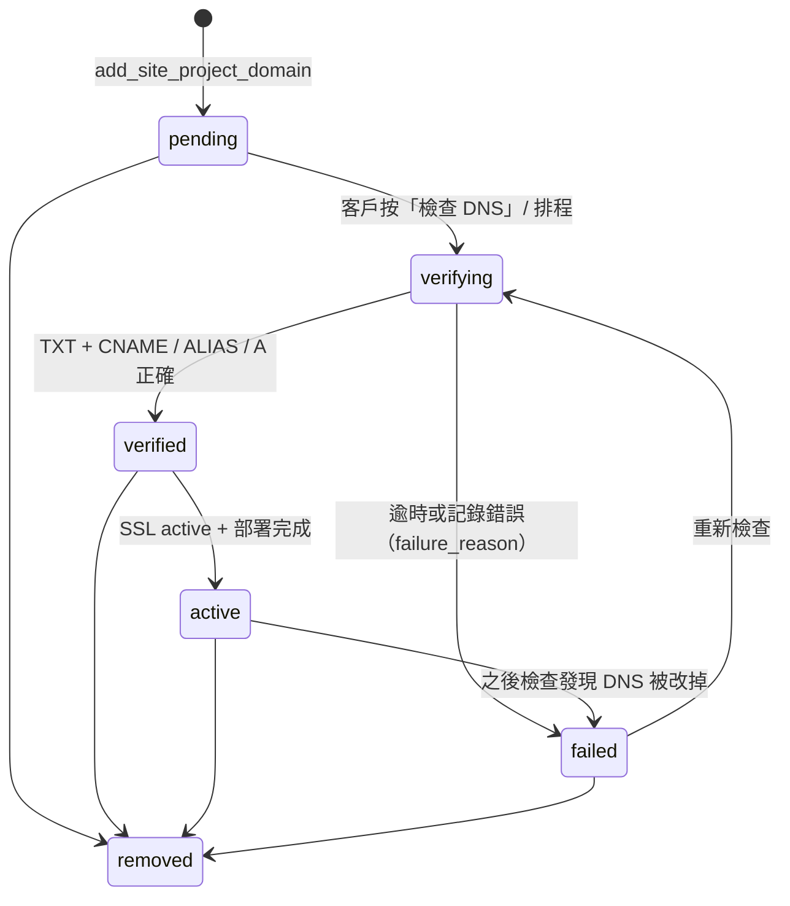

# Domain / DNS / Deployment 規格 v2.0

## 1. 階段

| 階段 | 發布方式 | 旗標（`platform.feature_flags`） | 資料 |
|---|---|---|---|
| v1 | 不公開發布，只有預覽 | 全部 false | `publish_mode = preview_only`；`site_deployments.is_dry_run = true`、`status = skipped` |
| v2 | 森映平台子網域 | `site_builder.platform_subdomain`、`site_builder.public_publish` | `domain_type = platform_subdomain` |
| v3 | 客戶自訂網域 / DNS / 轉址 | `site_builder.custom_domain` | `custom_subdomain`、`custom_apex` |

資料表與狀態流程在 v1 就完整建立，開放時只需切換旗標。

## 2. 網域類型

| domain_type | 範例 | DNS 設定 | 建議 |
|---|---|---|---|
| `platform_subdomain` | `client.sites.<平台網域>` | 不需要 | v2 預設 |
| `custom_subdomain` | `www.client.com`、`shop.client.com.tw` | CNAME + TXT 驗證 | **優先建議 www** |
| `custom_apex` | `client.com` | ALIAS / ANAME / CNAME Flattening，或 A 記錄；+ TXT 驗證 | 建議改用 www，裸網域 301 轉址到 www |

裸網域判斷：最後兩段是已知二級公共後綴（`com.tw`、`org.tw`、`net.tw`、`edu.tw`、`gov.tw`、`idv.tw`、`com.hk`、`co.jp`、`co.uk`、`com.au`…）時，註冊網域取三段，否則取兩段。清單不足時，可擴充 `generate_dns_instruction()` 內的 `v_second_level` 陣列（完整 Public Suffix List 建議在 Edge Function 處理）。

## 3. 平台 DNS 設定

`cms_site_settings` key `platform.dns`（非公開）：

```json
{
  "cname_target": "cname.sites.example.com",
  "apex_a_records": [],
  "platform_subdomain_suffix": "sites.example.com",
  "verification_txt_prefix": "_syt-verify",
  "default_ttl": 3600,
  "is_placeholder": true
}
```

Seed 使用 RFC 2606 保留網域 `example.com`。正式上線前由 owner 改成實際值並把 `is_placeholder` 設為 `false`；是占位值時，所有 DNS 指示都會附上「僅供預覽，請勿實際設定」警告。

## 4. `generate_dns_instruction(domain) → jsonb`

輸入會正規化：去空白、轉小寫、移除 `https://`、路徑、查詢字串、port、結尾 `.`。

**輸出範例：`www.client.com`**

```json
{
  "domain": "www.client.com",
  "domain_type": "custom_subdomain",
  "apex_domain": "client.com",
  "subdomain_label": "www",
  "recommended_domain": "www.client.com",
  "domain_id": "<已新增網域時才有>",
  "verification": {"record_type": "TXT", "record_name": "_syt-verify.www.client.com", "value": "syt-verify=<32 碼>"},
  "records": [
    {"type": "CNAME", "host": "www", "name": "www.client.com", "value": "cname.sites.example.com", "ttl": 3600, "purpose": "routing", "required": true},
    {"type": "TXT", "host": "_syt-verify.www", "name": "_syt-verify.www.client.com", "value": "syt-verify=…", "ttl": 3600, "purpose": "ownership_verification", "required": true}
  ],
  "steps": ["登入網域註冊商或 DNS 代管服務…", "確認主機名稱「www」沒有既有的 A、AAAA 或 CNAME 記錄…", "…"],
  "warnings": ["請勿刪除既有的 MX 記錄…", "使用 Cloudflare 代理（橘色雲朵）時，驗證期間請先切換為「DNS only」…"],
  "is_placeholder_target": true,
  "generated_at": "2026-09-14T…"
}
```

**`client.com`（裸網域）** 的 records：

| type | host | 用途 | required |
|---|---|---|---|
| CNAME | `www` | 建議使用 www | false |
| ALIAS | `@` | 支援 ALIAS / ANAME / CNAME Flattening 時使用（與 A 擇一） | false |
| A | `@` | 不支援 ALIAS 時使用（`apex_a_records` 有設定才出現） | false |
| TXT | `_syt-verify` | 所有權驗證 | true |

並附警告：「裸網域不可設定一般 CNAME，會與 MX、NS 記錄衝突」。

**安全性**：驗證碼只回傳給該網站的 workspace 成員 / 森映 admin；其他人查同一個網域只會拿到占位文字，`domain_id` 為 null。

## 5. 新增網域

`add_site_project_domain(site_project_id, domain, make_primary default false) → jsonb`

| 步驟 | 動作 |
|---|---|
| 1 | 權限：`can_manage_site_project`（workspace owner / admin） |
| 2 | 階段檢查：platform_subdomain 需 v2 旗標、custom 需 v3 旗標（森映 admin 不受限，方便測試） |
| 3 | 全平台唯一（已 removed 的除外） |
| 4 | 建立 `site_project_domains`：`verification_token = syt-verify=<32 碼>`；平台子網域直接 `verified` |
| 5 | 產生並保存 `site_dns_instructions`（`is_current = true`） |
| 6 | 自訂網域建立 `site_domain_verifications`（TXT） |
| 7 | 建立 `site_ssl_certificates`（平台子網域 `pending`、自訂網域 `not_requested`） |
| 8 | audit log |

客戶不可直接 insert 網域，也不可自行把狀態改成 verified / active（guard trigger）；客戶可以改 `is_primary`、`redirect_to_primary`、`www_redirect`，或把狀態設成 `removed`。

## 6. 驗證與狀態流程



**DNS 檢查 Worker（Edge Function，service role）**

1. 取出 `pending / verifying / failed` 網域（`last_checked_at` 較舊者優先）。
2. 以 DNS-over-HTTPS 查詢 TXT / CNAME / A。
3. 每次檢查寫入 `site_domain_check_logs`（expected、observed、result、message）。
4. 更新 `site_domain_verifications`（`attempt_count`、`observed_values`、`status`）與 `site_project_domains`（`status`、`verified_at`、`last_checked_at`、`failure_reason`）。
5. 驗證通過 → 向部署平台（Cloudflare Pages / Vercel…）新增網域並申請 SSL → 更新 `site_ssl_certificates`。
6. SSL active + 部署 ready → 網域 `active`、`activated_at`。
7. 驗證碼 14 天未完成 → verification `expired`，提示客戶重新產生。

`failure_reason` 建議值：`txt_not_found`、`txt_mismatch`、`cname_not_found`、`cname_mismatch`、`conflicting_records`、`cloudflare_proxy_enabled`、`ssl_failed`、`timeout`。

## 7. 主要網域與轉址

- 每個網站最多一個 primary（partial unique index）。
- `redirect_to_primary = true`：其他網域 301 轉到 primary。
- `www_redirect`：`apex_to_www`（建議）、`www_to_apex`、`none`。

## 8. SSL

`site_ssl_certificates`：`provider`（platform_managed / cloudflare / vercel / netlify / letsencrypt）、`status`、`issuer`、`common_name`、`subject_alt_names`、`issued_at`、`expires_at`、`auto_renew`、`failure_reason`。**不儲存私鑰**。

## 9. 發布目標與部署

| 資料表 | 意義 |
|---|---|
| `customer_site_deployments` | **內容版本**：`publish_site_project()` 每次產生一版（version_number、content_snapshot） |
| `site_publish_targets` | 部署目標：preview / platform_subdomain / custom_domain / static_export；provider；`secret_refs` 只存參照 |
| `site_deployments` | **部署 job**：某內容版本 → 某目標；status queued → building → ready / failed；`is_dry_run` |

v1：`publish_site_project()` 會建立一筆 `site_deployments(status = skipped, is_dry_run = true)`，代表流程已走到部署點，但平台階段不實際部署。

## 10. DNS 串接教學頁

`site_dns_provider_guides`（Markdown 內容，可由 editor 管理）：`generic`、`cloudflare`、`godaddy`、`hinet`（seed 為草稿）。

客戶後台 DNS 教學頁建議組成：

1. 顯示 `site_dns_instructions.records`（可一鍵複製 host / value）。
2. 依 `provider_hint` 或客戶選擇的網域商，顯示對應 `site_dns_provider_guides.body_markdown`。
3. 顯示 `warnings`。
4. 「檢查 DNS」按鈕 → 觸發 Worker → 顯示最近 `site_domain_check_logs`。
5. 已有自訂網域的客戶：若偵測到裸網域，提示「建議使用 www.你的網域，並把裸網域轉址到 www」。
