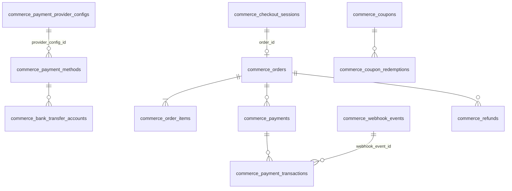
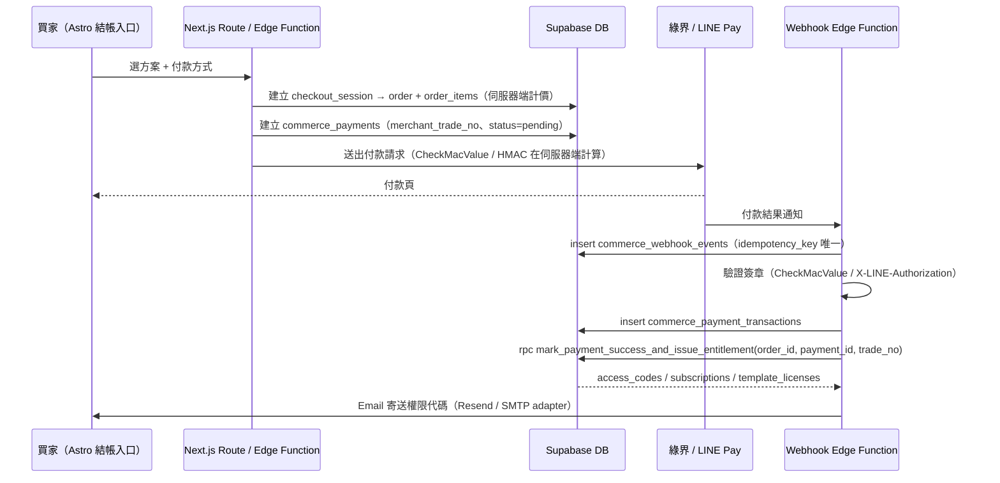

# 金流規格 v2.0

> 第一版 **不串正式金流**，但資料表、欄位、狀態與函式都已保留。
> 後台可以勾選啟用金流方式；勾選後才顯示該方式的設定欄位。

---

## 1. 支援範圍

| Provider | 付款方式（`method_key`） | method_type | 綠界 ChoosePayment | 一次性 | 訂閱 |
|---|---|---|---|---|---|
| 綠界 `ecpay` | `ecpay_credit_card` | credit_card | `Credit` | ✅ | — |
| 綠界 `ecpay` | `ecpay_credit_card_recurring` | credit_card_recurring | `Credit`（定期定額參數） | — | 月 / 年 |
| 綠界 `ecpay` | `ecpay_atm` | atm_virtual_account | `ATM` | ✅ | — |
| 綠界 `ecpay` | `ecpay_webatm` | web_atm | `WebATM` | ✅ | — |
| 銀行轉帳 `bank_transfer` | `bank_transfer` | bank_transfer | — | ✅ | — |
| LINE Pay `linepay` | `linepay` | linepay | — | ✅ | 保留（`supports_recurring` 可開） |
| 人工 `manual` | —（後台標記付款成功時自動建立） | manual | — | ✅ | — |

Seed 內所有 provider 與付款方式都是 **`is_enabled = false`**。

---

## 2. 資料表關係



---

## 3. 後台「勾選啟用」設計

### 3.1 Provider 層 `commerce_payment_provider_configs`

| 欄位 | 用途 |
|---|---|
| `provider` + `environment` | 唯一；sandbox 與 production 各一筆 |
| `is_enabled` | 勾選啟用；**同一 provider 同時只能啟用一個環境**（partial unique index） |
| `merchant_id` | 特店編號 / Channel ID（識別碼，非密鑰；仍只允許 owner / admin 讀取） |
| `api_base_url` | 必須 `https://` |
| `public_config` | 非敏感設定（通知路徑、語系…）；CHECK 禁止出現 `hash_key`、`secret`、`password`、`token`… 等欄位名 |
| `secret_refs` | 密鑰參照：`{"hash_key":"vault:ecpay_production_hash_key"}`；值只能是 `vault:` 或 `env:` 開頭 |
| `config_schema` | 後台表單欄位定義（勾選後才顯示） |

`config_schema` 範例（後台依此動態渲染表單）：

```json
[
  {"key": "merchant_id", "label": "特店編號 MerchantID", "type": "text", "required": true, "is_sensitive": false},
  {"key": "hash_key", "label": "HashKey（Vault 參照名稱）", "type": "secret_ref", "required": true, "is_sensitive": true},
  {"key": "hash_iv", "label": "HashIV（Vault 參照名稱）", "type": "secret_ref", "required": true, "is_sensitive": true},
  {"key": "notify_path", "label": "付款結果通知路徑 ReturnURL", "type": "path", "required": true, "is_sensitive": false}
]
```

`type = secret_ref` 的欄位：後台只讓 owner 輸入「參照名稱」，或提供「寫入 Vault」按鈕（由 server 端以 service role 呼叫 Vault，**明文不回傳前端、不寫入一般資料表**）。

### 3.2 付款方式層 `commerce_payment_methods`

| 欄位 | 用途 |
|---|---|
| `is_enabled` | 勾選啟用 |
| `config_schema` / `public_settings` | 方式層級設定（ATM 繳費期限天數、信用卡分期期數…） |
| `supports_one_time` / `supports_recurring` / `supported_intervals` | 結帳頁依商品價格週期篩選 |
| `min_amount_cents` / `max_amount_cents` / `fee_*` | 金額限制與手續費 |
| `payment_deadline_minutes` | ATM / 轉帳期限 |

### 3.3 結帳頁顯示條件

`get_enabled_payment_methods()`（anon 可呼叫）只回傳：

- 付款方式 `is_enabled = true`，且
- ecpay / linepay：對應 provider 有啟用中的設定；
- bank_transfer：至少一個啟用中的收款帳戶。

回傳欄位只有顯示用的公開資料，**不含** merchant_id、secret_refs、銀行帳號。

---

## 4. 密鑰管理（硬性規定）

1. Migration、seed、Git、前端 bundle **都不可以** 出現 HashKey、HashIV、Channel Secret、Service Role Key。
2. 正式值放在 **Supabase Vault** 或 **Edge Function Secrets**（`supabase secrets set ECPAY_PRODUCTION_HASH_KEY=...`）。
3. 資料庫只存參照名稱（`secret_refs`），Edge Function 依參照讀取：
   ```ts
   const ref = config.secret_refs.hash_key;           // "env:ECPAY_PRODUCTION_HASH_KEY" 或 "vault:..."
   const hashKey = ref.startsWith('env:') ? Deno.env.get(ref.slice(4)) : await readVaultSecret(ref.slice(6));
   ```
4. `request_payload_sanitized`、`response_summary`、`commerce_payment_transactions.request/response_payload` 都有 CHECK，禁止出現疑似密鑰欄位名。
5. 不儲存完整卡號；只存 `card_last4`、`auth_code`。

---

## 5. 付款流程

### 5.1 共用流程



**原則**

- 金額一律在伺服器端由 `commerce_product_prices` 計算，不相信前端傳入的金額。
- `commerce_orders.total_cents = subtotal - discount + tax`（CHECK）。
- Webhook 以 `idempotency_key`（例如 `ecpay:{MerchantTradeNo}:{RtnCode}:{TradeNo}`）去重；重送時 insert 失敗就直接回應成功。
- `mark_payment_success_and_issue_entitlement` 以訂單列鎖 + `entitlements_issued_at` 保證只發放一次。
- 綠界通知回應必須是 `1|OK`；在簽章驗證與寫入完成後才回應。

### 5.2 綠界欄位對應

| 綠界欄位 | 資料位置 |
|---|---|
| MerchantID | `commerce_payment_provider_configs.merchant_id` |
| MerchantTradeNo（≤20 英數） | `commerce_payments.merchant_trade_no`（CHECK `^[A-Za-z0-9]{1,20}$`，建議 `SYT` + yyMMddHHmmss + 5 碼） |
| MerchantTradeDate | `commerce_payments.created_at`（Asia/Taipei 格式化） |
| TotalAmount（整數） | `commerce_payments.amount_cents / 100`（TWD 價格 CHECK 必須整數元） |
| TradeDesc / ItemName | `commerce_order_items.product_name` 組合 |
| ReturnURL / ClientBackURL / PaymentInfoURL / PeriodReturnURL | `public_config.*_path` + 平台網域 |
| ChoosePayment | `commerce_payment_methods.provider_method_code` |
| TradeNo | `commerce_payments.provider_trade_no` |
| PaymentType | `commerce_payments.provider_payment_type` |
| RtnCode / RtnMsg | `commerce_payment_transactions.provider_rtn_code / provider_rtn_msg` |
| BankCode / vAccount / ExpireDate（ATM 取號） | `atm_bank_code` / `atm_virtual_account` / `payment_deadline_at`，付款狀態 `awaiting_transfer` |
| card4no / auth_code | `card_last4` / `auth_code` |
| PeriodAmount / PeriodType / Frequency / ExecTimes | `subscription_plan_prices.ecpay_*` + `commerce_payments.recurring_*` |
| CheckMacValue | 只在 Edge Function 計算與驗證，不存 |

### 5.3 ATM 虛擬帳號

1. 建立付款 → 綠界回傳取號資訊（PaymentInfoURL）→ 更新 `atm_*`、`payment_deadline_at`、`status = awaiting_transfer`、訂單 `awaiting_payment`。
2. 買家轉帳 → 綠界付款通知 → `mark_payment_success_and_issue_entitlement`。
3. 逾期 → 排程把 payment 設為 `expired`、訂單 `cancelled`。

### 5.4 銀行轉帳（人工對帳）

1. 結帳頁顯示 `get_bank_transfer_instructions(order_id)`（只有下單者 / admin 可呼叫）。
2. 買家回報後五碼 → server 寫入 `transfer_account_last5`、`transfer_reported_at`、`status = awaiting_transfer`。
3. owner / admin 在後台核對入帳 → 按「標記付款成功」→ `mark_payment_success_and_issue_entitlement(order_id)`（`is_manual_mark = true`、`reviewed_by`）。

### 5.5 LINE Pay

| 步驟 | 資料 |
|---|---|
| Request API | `commerce_payments` 建立、`idempotency_key` = orderId；回傳 `transactionId` 存 `provider_trade_no` |
| 使用者授權後導回 confirmUrl | `public_config.confirm_path` |
| Confirm API | 成功後 `mark_payment_success_and_issue_entitlement` |
| Channel Secret（HMAC-SHA256 簽章） | `secret_refs.channel_secret` 指向 Vault |

### 5.6 第一版（未串金流）

- `platform.feature_flags.commerce.checkout_enabled = false`、`commerce.live_payments = false`。
- 業務流程：客戶洽詢 / 匯款 → 森映 admin 在後台建立訂單 → 標記付款成功 → 系統自動產生權限代碼 → 寄給客戶。
- `mark_payment_success_and_issue_entitlement` 找不到付款列時，會自動建立 `provider = manual` 的付款紀錄。

---

## 6. `mark_payment_success_and_issue_entitlement(order_id, payment_id?, provider_trade_no?, note?)`

| 步驟 | 說明 |
|---|---|
| 權限 | `is_service_role()` 或 `is_admin()` |
| 冪等 | 訂單 `for update`；`entitlements_issued_at` 有值 → 回傳既有代碼，`already_processed = true` |
| 付款 | 指定或最新付款列 → `succeeded`；沒有則建立 manual 付款；寫入交易 ledger |
| 優惠碼 | reserved → applied；`redeemed_count + 1` |
| 訂閱商品（month / year） | 建立 `customer_subscriptions`（active）、第 1 期 `subscription_periods`、`subscription_invoices`（paid） |
| 付費版型 | 建立 `site_template_purchases`（paid）與 workspace 授權（需要 `order.workspace_id`） |
| 權限代碼 | 每個數量發 1 組 `issue_access_code`（持有者 = 下單者 / 買家 email） |
| 完成 | 訂單 `fulfilled`、`entitlements_issued_at = now()`、audit log |

回傳：

```json
{
  "ok": true,
  "already_processed": false,
  "order_id": "…",
  "order_number": "ORD-20260914-000123",
  "payment_id": "…",
  "access_codes": [{"code": "SYT-SEO-2026-A8K3Q9", "product_code": "SEO", "status": "issued"}],
  "subscriptions": [],
  "template_licenses": []
}
```

---

## 7. 退款

1. 建立 `commerce_refunds`（requested）→ owner / admin 核准（approved）→ 呼叫金流退款 API（processing）→ 成功（succeeded）。
2. `revoke_entitlements = true` 時：未兌換代碼 `revoke_access_code`；已兌換代碼一併撤銷權限；訂閱改為 cancelled。
3. 訂單狀態：全額 `refunded`、部分 `partially_refunded`。

---

## 8. Webhook 事件保存

| 欄位 | 說明 |
|---|---|
| `raw_payload` / `raw_body` | 原始資料，**只有 owner / admin 可讀**（RLS） |
| `headers_sanitized` | 移除 Authorization、Cookie 後的 headers |
| `payload_sha256` | 內容雜湊 |
| `signature_valid` / `signature_checked_at` | 簽章驗證結果 |
| `processing_status` / `processing_attempts` / `error_message` | 處理狀態與重試 |
| `payload_purged_at` | 建議保存 180 天後清除 raw_payload / raw_body（排程），保留處理結果 |

---

## 9. 電子發票（保留欄位）

`commerce_orders.invoice_type`（b2c_member / b2c_mobile_carrier / b2c_citizen_carrier / b2c_donation / b2b）、`buyer_tax_id`、`invoice_carrier_number`、`invoice_love_code`；`subscription_invoices.e_invoice_number`、`e_invoice_status`。第一版不串加值中心。
