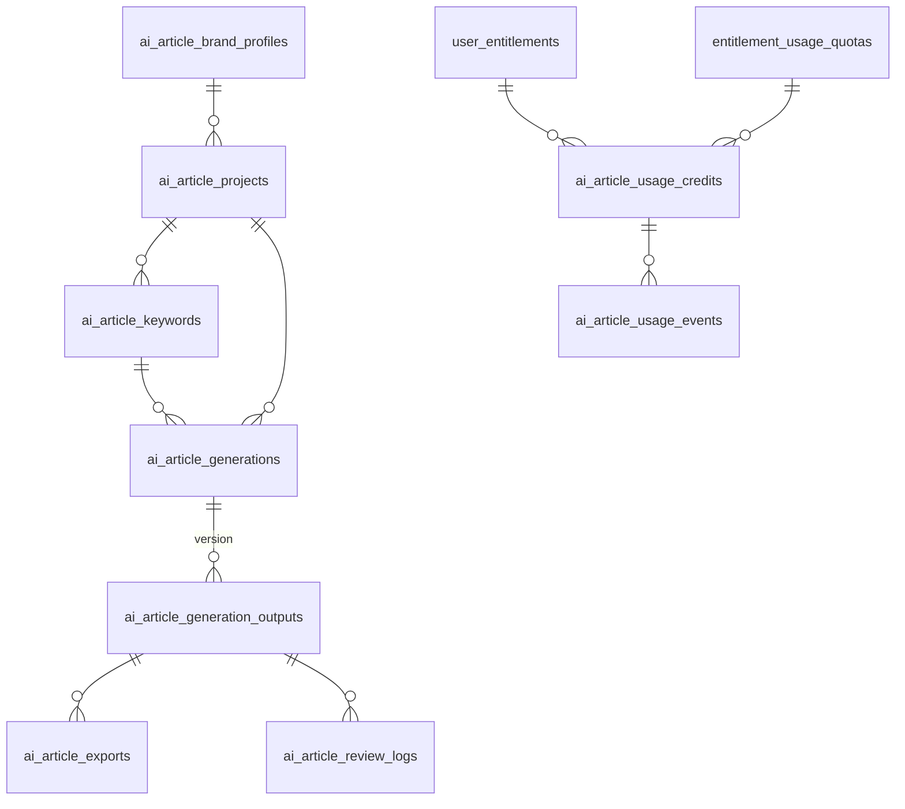
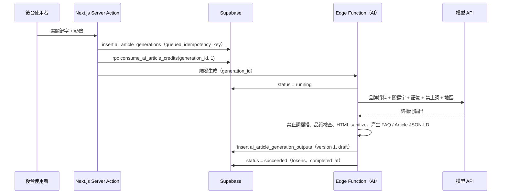
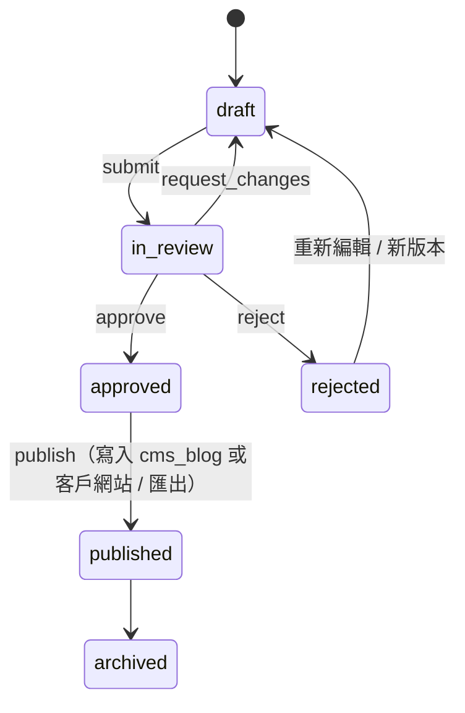

# SEO 文章生產器規格 v2.0

## 1. 階段

| 階段 | 使用者 | 資料範圍 | 權限 |
|---|---|---|---|
| v1 | 森映內部 | `workspace_id is null`、`access_scope = 'internal'` | 後台角色：owner / admin / editor / author 可寫，viewer 可讀 |
| v2 | 客戶 | `workspace_id` 有值、`access_scope = 'customer'` | `platform.feature_flags.ai_article_generator.customer_access = true` + `ai.article.generate` 權限 + workspace 角色 |

> 既有工具 `D:\project\seo-content-os`（使用者提供的可能位置）目前在 `external_project_connections` 標記為 **pending_audit**。盤點完成後，再決定沿用其 AI Engine 還是改寫到本 schema（見 §9）。

## 2. 資料表



| 資料表 | 需求對應 |
|---|---|
| `ai_article_brand_profiles` | **品牌資料**：品牌名、產業、目標客群、預設地區、**語氣**、**禁止詞** `banned_terms`、偏好詞、可驗證事實 `brand_facts`、CTA、內部連結 |
| `ai_article_projects` | 專案：品牌、發布目標網站、預設地區 / 語氣 / 禁止詞、目標字數 |
| `ai_article_keywords` | **目標關鍵字**：次要關鍵字、搜尋意圖、**地區**、搜尋量、難度、優先度、主題群、狀態 |
| `ai_article_generations` | 生成任務：輸入參數快照、prompt 版本、模型 provider / 名稱、token、扣除額度、idempotency_key |
| `ai_article_generation_outputs` | **SEO title、meta description、slug、H1、H2/H3（headings）、Markdown、HTML、FAQ、FAQ schema、Article schema**、內部連結、字數、禁止詞命中、品質檢查、**草稿 / 審核 / 發布狀態** |
| `ai_article_exports` | **匯出**：markdown、html、wordpress_html、json_ld；目標 download / customer_site / cms_blog / wordpress / external_project |
| `ai_article_usage_credits` | **使用額度**帳戶（權限額度 / 訂閱 / 後台發放 / 購買 / 內部） |
| `ai_article_usage_events` | 額度異動紀錄（append-only） |
| `ai_article_review_logs` | 審核紀錄（append-only） |

## 3. 輸出欄位格式

```json
{
  "seo_title": "台中牙齒美白推薦｜費用、療程與注意事項",
  "meta_description": "整理台中牙齒美白的療程差異、費用區間與術後保養…",
  "slug": "taichung-teeth-whitening",
  "h1": "台中牙齒美白怎麼選？療程、費用與注意事項",
  "headings": [
    {"level": 2, "text": "牙齒美白有哪些方式", "anchor": "methods"},
    {"level": 3, "text": "冷光美白", "anchor": "cold-light"}
  ],
  "faq": [{"question": "美白可以維持多久？", "answer": "…"}],
  "faq_schema_json": {"@context": "https://schema.org", "@type": "FAQPage", "mainEntity": [ … ]},
  "article_schema_json": {"@context": "https://schema.org", "@type": "Article", "headline": "…"},
  "quality_checks": {
    "h1_count": 1,
    "title_length": 24,
    "description_length": 96,
    "keyword_in_title": true,
    "banned_terms_found": 0,
    "faq_count": 5
  }
}
```

檢查規則沿用官網 SEO 驗收：單一 H1、Title 約 30–60 字元等效長度、Description 約 80–160、FAQ 有對應 FAQPage Schema、不可出現禁止詞（例：專注於、致力於、賦能、一站式）。`body_html` 輸出前必須 sanitize（禁止 script、iframe、on* 屬性）。

## 4. 生成流程



- **模型 API key 不存資料庫**，放在 Edge Function Secrets；`input_params` 有 CHECK 禁止疑似密鑰欄位。
- 失敗時 status = failed、`error_message`；是否退回額度由營運決定（建議系統錯誤退回，寫入 `ai_article_usage_events.event_type = 'refund'`）。

## 5. 審核與發布



每次動作寫入 `ai_article_review_logs`（`reviewer_id = auth.uid()`、from / to status、comment、checklist）。

發布目標：

| 目標 | 做法 |
|---|---|
| 森映官網 Blog（v1 內部） | 轉成 `blog_posts`（draft）+ `seo_metadata`；仍走 CMS 發布流程 |
| 客戶網站（v2） | 寫入客戶網站文章區塊或匯出 |
| WordPress | 匯出 `wordpress_html`，由 Edge Function 呼叫 WordPress REST API（帳密放 secrets） |
| 下載 | `ai-article-exports` bucket：`internal/…` 或 `{workspace_id}/…` |

## 6. 額度

`consume_ai_article_credits(generation_id, credits default 1)`

| 情況 | 行為 |
|---|---|
| 已扣過（`credits_charged > 0`） | 回傳 replayed（冪等） |
| 內部（workspace_id is null） | 需後台角色；不扣客戶額度，只記錄使用事件 |
| 客戶（v2） | 需 `can_access_ai_workspace(ws, owner/admin/editor)`；鎖定額度帳戶；帳戶來自權限時同步 `consume_usage_quota(..., 'ai.article.generate', credits, 'ai.generation:<id>')`；額度用完 → `AI article credits exhausted` |

額度來源：

- `AI` 權限代碼兌換後，`entitlement_usage_quotas` 會有 `ai.article.generate` 月額度（seed 暫定 30 篇 / 月，待確認）。
- 開通客戶時建立 `ai_article_usage_credits(source_type = 'entitlement', user_entitlement_id, entitlement_usage_quota_id, credits_total)`。
- 後台加贈：`source_type = 'admin_grant'`。
- `run_entitlement_expiry_job()` 會把期間結束或權限失效的額度設為 expired。

## 7. 匯出格式

| format | 內容 |
|---|---|
| `markdown` | Front matter（title、description、slug）+ Markdown 內文 + FAQ |
| `html` | 語意化 HTML（單一 h1、h2 / h3 帶 id） |
| `wordpress_html` | Gutenberg 相容 HTML（`<!-- wp:heading -->` 等區塊註解），FAQ 以 HTML 呈現 |
| `json_ld` | `[Article, FAQPage, BreadcrumbList]` JSON-LD 陣列 |

## 8. 權限摘要

| 資料 | 內部（v1） | 客戶（v2） |
|---|---|---|
| 讀取 | 任何後台角色 | workspace 成員（含 viewer）＋旗標＋權限 |
| 新增 / 修改 | owner / admin / editor / author | workspace owner / admin / editor |
| 刪除 | owner / admin | workspace owner / admin |
| 額度發放 | owner / admin | 森映 owner / admin |
| 審核紀錄 | owner / admin / editor（以自己名義） | workspace owner / admin / editor |

## 9. 與既有 seo-content-os 的整合（pending audit）

1. 盤點 `D:\project\seo-content-os` 的 `supabase/migrations`、prompt / template 版本管理、生成佇列與 embedding 設計。
2. 對照本 schema：
   - 生成佇列 / 步驟 → `ai_article_generations`（必要時增加 `ai_article_generation_steps`）
   - Prompt 版本 → `prompt_version`（必要時拆 `ai_prompt_templates`）
   - 文章語意向量 / 去重 → 另加 pgvector 資料表（本版未建立）
3. 在 `external_project_cms_mappings` 記錄對應，確認後再決定 v2.1 migration。
