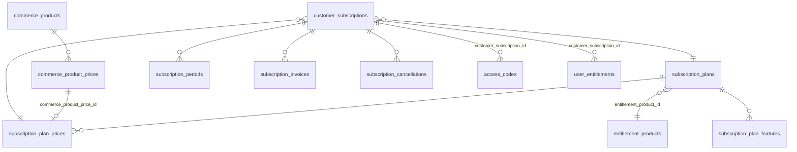
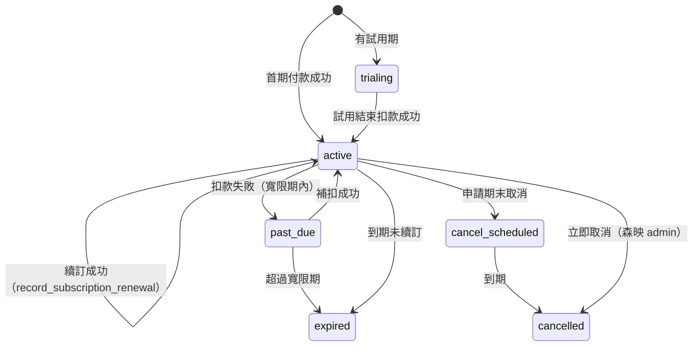

# 訂閱規格 v2.0

## 1. 支援的購買型態

| 型態 | `commerce_product_prices.billing_interval` | 權限到期 | 金流 |
|---|---|---|---|
| 一次性購買 | `one_time` | 依 `entitlement_duration_days` / `default_duration_days`；null = 永久 | 信用卡、ATM、WebATM、銀行轉帳、LINE Pay |
| 月訂閱 | `month`（`interval_count` 可 1–36） | 訂閱 `current_period_end` | 綠界信用卡定期定額（PeriodType = M） |
| 年訂閱 | `year` | 訂閱 `current_period_end` | 綠界信用卡定期定額（PeriodType = Y） |

## 2. 資料模型



| 資料表 | 重點欄位 |
|---|---|
| `subscription_plans` | `plan_key`、`product_code`、`entitlement_product_id`（實際發放的權限）、`max_site_projects`、`is_public`、`is_active` |
| `subscription_plan_prices` | `commerce_product_price_id`（金額唯一來源）、`billing_interval`、`interval_count`、`auto_renew_default`、`grace_period_days`、`max_retry_count`、`ecpay_period_type` / `ecpay_frequency` / `ecpay_exec_times` |
| `subscription_plan_features` | 方案比較表顯示（`display_label`、`display_value`）；實際權限以 `entitlement_feature_rules` 為準 |
| `customer_subscriptions` | `customer_user_id`（帳務擁有者）、`workspace_id`、`status`、`current_period_start / end`、`auto_renew`、`renewal_status`、`next_billing_at`、`retry_count`、`cancel_at_period_end`、`provider_subscription_ref` |
| `subscription_periods` | 每期 `period_index`、`period_start / end`、`status`、`payment_id` |
| `subscription_invoices` | `invoice_number`（INV-YYYYMM-000001）、金額、`status`、電子發票欄位 |
| `subscription_cancellations` | `cancel_type`（at_period_end / immediate）、`reason_code`、`status`、`effective_at` |

**一致性保護**

- `subscription_plan_prices` 的週期必須與 `commerce_product_prices` 相同（trigger `validate_subscription_plan_price`）。
- 月繳 `ecpay_period_type` 只能是 `M`，年繳只能是 `Y`；一次性不可有定期定額參數。
- active / trialing / past_due / cancel_scheduled 必須有 `current_period_end`。

## 3. 狀態



| status | 權限 |
|---|---|
| trialing / active / past_due / cancel_scheduled | 有效（到 `current_period_end`） |
| cancelled / expired | 停用 |

`renewal_status`：`auto`（自動扣款）、`manual`（手動續約）、`disabled`（已取消續訂）、`pending_retry`（重試中）、`failed`（續訂失敗）。

## 4. 首期購買

由 `mark_payment_success_and_issue_entitlement` 處理（見 PAYMENT_SPEC §6）：

1. 找到訂單項目對應的 `subscription_plan_prices`。
2. 建立 `customer_subscriptions`（active、首期期間、`next_billing_at`）。
3. 建立第 1 期 `subscription_periods`（paid）與 `subscription_invoices`（paid）。
4. 發放帶 `customer_subscription_id` 的權限代碼。
5. 代碼兌換後，`user_entitlements.expires_at = current_period_end`。

> 訂閱需要登入帳號下單（`customer_user_id` 必填）。付款者是帳務擁有者；代碼可以轉讓給實際使用的人。

## 5. 續訂

綠界定期定額每期扣款後會通知 PeriodReturnURL：

```ts
// Edge Function（service role），驗證 CheckMacValue 並寫入 webhook_events 後
await supabaseAdmin.from('commerce_payments').insert({ /* 本期付款，provider_trade_no, status: 'succeeded' ... */ });
await supabaseAdmin.rpc('record_subscription_renewal', { subscription_id, payment_id });
```

`record_subscription_renewal(subscription_id, payment_id)`：

- 同一 `payment_id` 重送 → `already_processed`（冪等）。
- 新期間 = `max(current_period_end, now())` 起算一個週期。
- 新增 `subscription_periods`、更新訂閱期間、`retry_count = 0`。
- 已兌換的訂閱權限 `expires_at` 一起延長。

扣款失敗：server 將訂閱設為 `past_due`、`renewal_status = pending_retry`、`retry_count + 1`；超過 `max_retry_count` 或寬限期後由排程設為 `expired`。

## 6. 取消

`request_subscription_cancellation(subscription_id, cancel_type = 'at_period_end', reason_code, reason_text)`

| cancel_type | 誰可以 | 結果 |
|---|---|---|
| `at_period_end` | 帳務擁有者、workspace owner、森映 admin | `cancel_scheduled`、關閉自動續訂；權限用到本期結束 |
| `immediate` | 森映 admin / service | `cancelled`、權限立即停用；退款另走 `commerce_refunds` |

綠界定期定額需另外呼叫「停用定期定額」API（Edge Function），成功後在 `subscription_cancellations` 記錄處理結果。

## 7. 到期停用權限（排程）

`run_entitlement_expiry_job()` 建議每 15 分鐘或每小時執行一次（pg_cron 或 Edge Function Scheduler，以 service role 呼叫）：

| 對象 | 條件 | 結果 |
|---|---|---|
| 未兌換代碼 | `expires_at <= now()` | `expired` |
| 訂閱 | `current_period_end + 寬限期 <= now()`（期末取消不給寬限） | `expired` 或 `cancelled` |
| 權限 | `expires_at <= now()`，或所屬訂閱已 cancelled / expired | `expired` |
| 版型授權 | `expires_at <= now()` | `expired` |
| AI 額度 | 期間結束或權限失效 | `expired` |

權限失效後：`has_active_entitlement()` 回傳 false、`workspace_has_feature()` 回傳 false、`can_create_site_project()` 不再有額度、`can_access_ai_workspace()` 失效。已建立的網站資料保留；是否下架前台由營運決定（`customer_site_projects.status = suspended`）。

pg_cron 範例（啟用 extension 後由 owner 手動設定，不放在 migration）：

```sql
select cron.schedule('syt-entitlement-expiry', '*/15 * * * *', $$select public.run_entitlement_expiry_job()$$);
```

## 8. 額度週期

`entitlement_feature_rules.quota_period`：

- `lifetime`：一次性額度（例如 `site.create = 1`）。
- `month` / `year`：兌換時建立第一期；`consume_usage_quota()` 發現目前時間已超過最後一期時，自動建立新的一期（`quota_used = 0`）。

## 9. 待業主確認

- 各方案月繳 / 年繳價格（seed 為 0 且未啟用）。
- 寬限期天數（預設 3 天）、最多重試次數（預設 3 次）。
- 是否提供試用期（`commerce_product_prices.trial_days`）。
- 一次性購買的 SEO / LP 方案是否含年限（目前為永久）。
