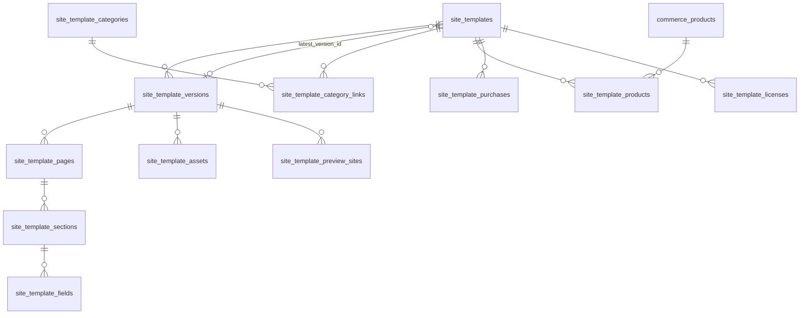

# Template Marketplace 規格 v2.0

## 1. 定價類型

| pricing_type | 誰看得到 | 誰能套用 / 發布 | 必填欄位 |
|---|---|---|---|
| `free` 免費 | 所有人（已發布） | 所有 workspace | — |
| `paid` 付費 | 所有人（已發布） | 有有效 `site_template_licenses` 的 workspace | 對應 `site_template_products`（販售商品） |
| `plan_restricted` 方案限定 | 所有人（已發布） | workspace 有 `required_feature_id` 的有效權限，或有授權 | `required_feature_id`（例：`template.premium`） |
| `private` 私人客製 | 只有 `owner_workspace_id` 成員與森映後台 | 只有 `owner_workspace_id` | `owner_workspace_id` |

CHECK：`private` ⇔ `owner_workspace_id` 有值；`plan_restricted` ⇒ `required_feature_id` 有值。

**未購買者可預覽，不可套用發布**：

- 預覽：RLS 允許讀取已發布版型、版本、頁面 / 區塊 / 欄位定義與 `site_template_preview_sites`。
- 套用：`create_site_project_from_template()` 會檢查 `can_workspace_use_template()`。
- 發布：`publish_site_project()` 會再檢查一次 `can_use_template()`，授權被撤銷（例如退款）後不能發布。

## 2. 資料結構

### 2.1 `site_template_versions`

| 欄位 | 說明 |
|---|---|
| `version` | semver（`1.0.0`），`(template_id, version)` 唯一 |
| `status` | draft / published / deprecated |
| `astro_entry_path` | Astro 模板入口，**repo 相對路徑**（例：`src/templates/seo-starter/index.astro`）；CHECK 禁止絕對路徑與 `..` |
| `schema_json` | 整體結構與欄位 JSON Schema（與 pages / sections / fields 表同步，供 Astro build 與後台 Zod 產生器使用） |
| `default_content_json` | 預設內容：`{"pages": {"<page_key>": {"<section_key>": {"<field_key>": <value>}}}}` |
| `theme_defaults_json` | `{"theme_variant", "color_tokens", "typography"}` |

### 2.2 欄位定義：客戶後台看到什麼

`site_template_fields`

| 欄位 | 用途 |
|---|---|
| `field_key` / `label` / `field_type` | 後台表單欄位與型別（`site_field_type`） |
| `is_required` | 發布前必填檢查 |
| `is_customer_editable` | **false = 客戶後台不顯示**（由模板固定，例如錨點 ID） |
| `group_label` / `help_text` / `placeholder` / `sort_order` | 後台表單呈現 |
| `validation_schema` | JSON Schema（maxLength、maxItems、repeater item 形狀） |
| `options` | select 選項等 |
| `default_value` | `default_content_json` 沒有值時使用 |

建站時，模板欄位會 **複製** 到 `customer_site_section_fields`（保留 `template_field_id`），所以模板之後改版不會直接改動既有網站。

## 3. 從模板建立網站

`create_site_project_from_template(workspace_id, template_id, project_name default null) → uuid`

| 步驟 | 檢查 / 動作 |
|---|---|
| 1 | 呼叫者是 workspace owner / admin（或森映 admin / service） |
| 2 | `select ... for update` 鎖定 workspace；workspace 必須 active |
| 3 | `can_workspace_use_template()`；未授權 → `template is not licensed for this workspace (preview only)` |
| 4 | 取得已發布版本（優先 `latest_version_id`） |
| 5 | 網站類型權限：`workspace_has_feature(ws, 'site.type.' || site_type)`（v1 SEO 代碼只含 seo_website） |
| 6 | 網站數量：`site_project_limit_override` 或 `site.create` 額度（v1 每組代碼 1） |
| 7 | 建立 project → `consume_usage_quota(entitlement, 'site.create', 1, 'site.create:<project_id>')` |
| 8 | 建立 settings、theme（模板預設）、publish settings（preview_only）、footer、header / footer 選單 |
| 9 | 逐頁複製 pages（含預設 SEO）→ sections → fields → draft content values |
| 10 | 選單項目（legal 頁放 footer）、有 contact 頁時建立預設聯絡表單 |
| 11 | audit log |

## 4. 授權與購買

### 4.1 付費版型購買

1. 商品：`commerce_products`（`product_kind = 'template'`）+ `site_template_products`（`relation_type = 'sells_template'`）。
2. 下單：`commerce_order_items.template_id`，訂單需帶 `workspace_id`。
3. 付款成功：`mark_payment_success_and_issue_entitlement` 建立 `site_template_purchases`（paid）與 `site_template_licenses`（`source_type = 'purchase'`、`license_scope = 'workspace'`）。
4. 同一 workspace 同一版型只會有一筆 active workspace 授權（partial unique index）。

### 4.2 授權範圍

| license_scope | 效果 |
|---|---|
| `workspace` | 該 workspace 所有網站可用 |
| `site_project` | 只有指定網站可用（例如單站授權） |

`source_type`：`purchase`、`plan`、`private_owner`、`admin_grant`。

### 4.3 撤銷

退款或違規時把授權改成 `revoked`（`revoked_at`、`revoked_reason`）；已建立的網站保留草稿，但 `publish_site_project()` 會拒絕。

## 5. 私人客製版型 → 公開付費版型

1. 客製專案完成時建立 `pricing_type = 'private'`、`owner_workspace_id = 客戶 workspace` 的版型。
2. 取得客戶同意與素材授權後，**建立新的版型列**（不直接改原列）：
   - `pricing_type = 'paid'`、`owner_workspace_id = null`
   - `source_template_id = 原私人版型 id`、`converted_to_public_at = now()`
   - 複製版本並移除客戶專屬內容（Logo、文案、圖片）
3. 原客戶保留私人版型；可另外給 `site_template_licenses(source_type = 'admin_grant')` 讓他使用公開版後續更新。

## 6. 預覽站

`site_template_preview_sites`：`preview_slug` 唯一、`preview_url`（https）、`screenshot_asset_id`、`is_active`。Astro 以 `default_content_json` 產生預覽頁，建議 `noindex`。

## 7. Seed 版型（草稿）

| template_key | 類型 | 頁面 |
|---|---|---|
| `seo_starter` | SEO 形象官網，免費 | 首頁（hero / services / faq / cta）、關於、服務、聯絡（含表單）、隱私權 |
| `landing_basic` | 一頁式網頁，免費 | 首頁（hero / benefits / testimonials / faq / contact） |

兩者 `status = draft`、版本 `1.0.0` draft。Astro 模板完成並通過設計審核後，再把版本與版型改為 published。

## 8. 後台實作建議

- 版型列表：`site_templates` + `site_template_category_links`；卡片上以 `can_workspace_use_template()` 顯示「可使用 / 購買 / 升級方案」。
- 欄位表單：依 `customer_site_section_fields` 動態產生 Zod schema 與表單元件，只顯示 `is_customer_editable = true`。
- 模板改版：新版本發布後，既有網站可提供「套用新版本」遷移工具（比對 field_key，新增欄位、保留內容），第一版不自動升級。
