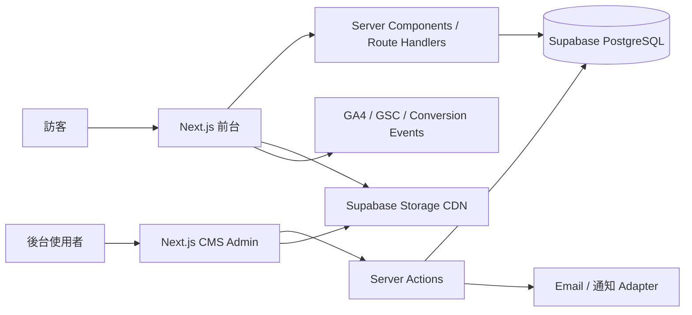
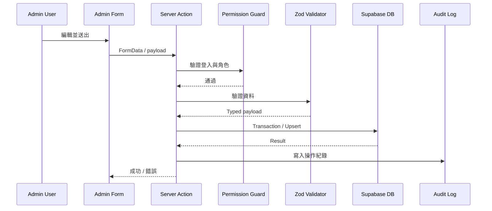

# 森映品牌官網整體架構設計 v1.0

> 依據文件：`森映品牌官網_CMS與SEO規劃_v1.0.md`  
> 文件用途：作為前台、CMS 後台、Supabase、SEO、部署與 AI Agent 開發的整體技術藍圖。  
> 專案定位：森映品牌母站、產品與 App Hub、服務入口、案例展示、SEO 內容中心與合作詢問平台。

---

## 1. 架構目標

本官網需同時完成以下五件事：

1. 清楚呈現森映品牌、產品、App、服務與案例。
2. 所有主要內容均可由 CMS 後台調整，避免頻繁修改程式碼。
3. 每個公開頁面具備完整 SEO、OG、Canonical、Schema 與 Sitemap 控制。
4. 後台支援 owner、admin、editor、author、viewer 五種角色。
5. 保留未來 App Hub、Mori Account、AI 漫劇與多產品整合能力。

---

## 2. 技術架構總覽

### 2.1 建議技術棧

| 層級 | 技術 |
|---|---|
| 前台框架 | Next.js App Router + TypeScript strict |
| UI | Tailwind CSS + 自建 Design Tokens + Radix UI / shadcn/ui |
| 後台 | 同一 Next.js 專案內 `/admin` 路由 |
| DB | Supabase PostgreSQL |
| Auth | Supabase Auth |
| 檔案 | Supabase Storage |
| 驗證 | Zod |
| 表單 | React Hook Form + Server Actions |
| 部署 | Vercel |
| SEO | Next.js Metadata API + JSON-LD Builder |
| 分析 | GA4、GSC、UTM、內部 conversion_events |
| 郵件 | Resend 或 SMTP Adapter |

### 2.2 系統關係



### 2.3 架構原則

- 前台以 Server Components 為主，互動元件才使用 Client Components。
- 公開內容只讀取 `published` 且已到發布時間的資料。
- CMS 所有修改必須經過角色驗證與 Zod 驗證。
- SEO 內容不寫死在頁面元件，統一由 SEO Resolver 取得。
- 首頁、產品、服務、案例使用區塊式內容；文章使用 Markdown 或 Rich Text。
- 前後台共用 types、validators 與 repository，不重複定義資料型別。

---

## 3. 網站資訊架構

### 3.1 公開前台

```txt
/
/products
/products/brand-website
/products/badminton-platform
/products/mori-commerce
/products/tools-app
/products/ai-content
/solutions
/solutions/website
/solutions/app-mvp
/solutions/seo-content
/solutions/cms-system
/cases
/cases/[slug]
/blog
/blog/category/[slug]
/blog/tag/[slug]
/blog/[slug]
/about
/contact
/faq
/privacy
/terms
```

### 3.2 CMS 後台

```txt
/admin
/admin/pages
/admin/pages/[id]
/admin/home-sections
/admin/products
/admin/products/[id]
/admin/services
/admin/services/[id]
/admin/cases
/admin/cases/[id]
/admin/posts
/admin/posts/[id]
/admin/categories
/admin/tags
/admin/faqs
/admin/ctas
/admin/media
/admin/seo
/admin/redirects
/admin/navigation
/admin/inquiries
/admin/users
/admin/settings
/admin/audit-logs
```

### 3.3 第二階段保留路由

```txt
/app-hub
/app-hub/[slug]
/ai-drama
/ai-drama/[slug]
/resources
/resources/templates
/resources/guides
/pricing
/mori-account
```

---

## 4. 前台頁面架構

## 4.1 全站 Layout

```txt
RootLayout
├─ Metadata defaults
├─ Organization JSON-LD
├─ Analytics scripts
├─ Header
│  ├─ Logo
│  ├─ DesktopNavigation
│  ├─ MobileNavigation
│  └─ PrimaryCTA
├─ Main
├─ GlobalCTABanner（依頁面設定顯示）
├─ Footer
└─ Cookie / Privacy controls
```

### Header 行為

- Sticky，桌機高度 72–80px。
- 首頁頂部可使用深藍黑背景。
- 手機使用 Drawer Menu。
- 主 CTA 固定為「預約討論」。
- 選單由 `navigation_menus` 與 `navigation_items` 讀取。

### Footer 結構

- 品牌簡介
- 產品與 App
- 解決方案
- 資源
- 關於森映
- 聯絡資訊
- 隱私權與使用條款

---

## 4.2 首頁 `/`

### 區塊順序

```txt
HeroSection
TrustFeatureBar
ProductGridSection
SolutionGridSection
FeaturedCaseSection
LatestPostSection
FaqPreviewSection
PrimaryCtaBanner
```

### Hero Section

**H1**

> 把網站、App 和內容，做成真的能用的產品

**副標**

> 森映把品牌官網、App、內容與後台整理成可上線、可管理、可持續經營的數位產品。

**CTA**

- 預約討論
- 探索解決方案

**右側視覺**

- 專案總覽
- 網站流量
- 聯絡表單
- 專案進度
- 最近動態
- 技術支援

右側視覺第一版可使用靜態 UI Mock 元件，不使用真實商業數據。

### 首頁 CMS Section Model

每個 section 至少包含：

```ts
interface CmsPageSection {
  id: string;
  pageId: string;
  sectionType:
    | 'hero'
    | 'feature_bar'
    | 'product_grid'
    | 'solution_grid'
    | 'case_slider'
    | 'blog_preview'
    | 'faq_preview'
    | 'cta_banner'
    | 'custom';
  title: string | null;
  subtitle: string | null;
  content: Record<string, unknown>;
  sortOrder: number;
  isEnabled: boolean;
  visibility: 'all' | 'desktop' | 'mobile';
}
```

---

## 4.3 產品與 App `/products`

### 頁面結構

```txt
ProductsHero
ProductCategoryFilter
ProductGrid
ProductRoadmap
CrossProductCTA
FaqSection
```

### 產品卡片欄位

- 名稱
- 短描述
- 封面圖 / icon
- 狀態：已上線、測試中、規劃中
- 平台：Web、iOS、Android
- 外部連結
- App Store / Google Play 連結
- 主要 CTA

---

## 4.4 產品詳細頁 `/products/[slug]`

### 共用模板

```txt
ProductHero
ProblemSection
FeatureGrid
WorkflowSection
ScreenshotsGallery
TechnicalOverview
RoadmapSection
RelatedCases
FaqSection
ProductCTA
```

### 羽球排組平台特別區塊

- 建立場次
- 報名與候補
- LINE 綁定
- 排組管理
- 月費與儲值金
- 觀看廣告免費建立場次
- App 化 Roadmap

### 廣告獎勵文案原則

- 顯示「觀看廣告，免費建立 1 場」。
- 使用者需主動點擊。
- 不設定每日一次上限。
- 後端保留異常行為偵測、重複 callback 防護與 reward idempotency。
- 免費資格不可轉讓、不可兌現。

---

## 4.5 解決方案 `/solutions`

### 頁面結構

```txt
SolutionsHero
SolutionComparison
WebsiteSolution
AppMvpSolution
SeoContentSolution
CmsSystemSolution
EngagementProcess
PricingPreview
FaqSection
ContactCTA
```

### 價格呈現

採「公開基礎方向，不公開客製價格」：

- 顯示起始價格文字或適合對象。
- 客製項目使用「依功能與範圍評估」。
- CTA 為「取得初步建議」「預約討論」。

---

## 4.6 服務詳細頁 `/solutions/[slug]`

### 共用模板

```txt
ServiceHero
AudienceSection
DeliverablesSection
ProcessSection
FeatureList
PricingSummary
RelatedCases
FaqSection
InquiryCTA
```

每個服務頁需具備獨立 SEO Meta、FAQ 與 Schema。

---

## 4.7 案例 `/cases`

### 列表頁

```txt
CasesHero
CaseCategoryFilter
FeaturedCase
CaseGrid
ServiceCTA
```

### 詳細頁

```txt
CaseHero
ProjectSummary
BackgroundProblem
SolutionApproach
ArchitectureOrProcess
Gallery
Metrics
RelatedServices
NextStepCTA
```

成果指標只能使用可驗證資料；沒有數據時改用質化成果，不建立虛構數字。

---

## 4.8 文章 `/blog`

### 列表頁

```txt
BlogHero
FeaturedPost
CategoryNavigation
LatestPostGrid
Pagination
NewsletterOrCTA
```

### 詳細頁

```txt
ArticleHeader
Breadcrumb
ArticleMeta
TableOfContents
MarkdownBody
InlineCTA
RelatedPosts
FaqSection（選配）
AuthorBox
```

### 文章內容格式

第一版建議使用 Markdown + 自訂元件，而非完整自由排版 Rich Text。

允許元件：

- Heading
- Paragraph
- List
- Quote
- Image
- Table
- Callout
- CTA
- FAQ
- Code block

---

## 4.9 關於森映 `/about`

```txt
AboutHero
WhatWeBuild
BrandPrinciples
CurrentProducts
HowWeWork
Roadmap
CollaborationCTA
```

語氣直接自然，不使用「專注於」「致力於」「賦能」「一站式」等句型。

---

## 4.10 聯絡我們 `/contact`

```txt
ContactHero
ContactForm
ServiceShortcut
ProcessPreview
FaqPreview
ContactInfo
```

### 表單欄位

- 姓名
- 公司 / 品牌
- Email
- 電話或 LINE
- 想討論的項目
- 預算範圍
- 需求描述
- 如何得知森映
- 隱私權同意

### 防護

- Server-side validation
- Honeypot
- Rate limit
- Spam status
- IP hash，不儲存明文 IP
- Cloudflare Turnstile 可作第二階段

---

## 5. Design System

## 5.1 顏色 Tokens

```css
:root {
  --color-primary: #0F172A;
  --color-primary-hover: #1E293B;
  --color-secondary: #14B8A6;
  --color-secondary-hover: #0D9488;
  --color-secondary-soft: #F0FDFA;
  --color-background: #F8FAFC;
  --color-surface: #FFFFFF;
  --color-text: #111827;
  --color-muted: #64748B;
  --color-border: #E2E8F0;
  --color-success: #10B981;
  --color-warning: #F59E0B;
  --color-error: #EF4444;
}
```

## 5.2 Typography

- 中文：Noto Sans TC
- 英文與數字：Inter
- H1：`clamp(2.25rem, 5vw, 4rem)`
- H2：`clamp(1.75rem, 3vw, 2.5rem)`
- Body：16–18px
- 最大行寬：72ch

## 5.3 Spacing

採 4px 基準：

```txt
4 / 8 / 12 / 16 / 20 / 24 / 32 / 40 / 48 / 64 / 80 / 96
```

## 5.4 Grid

- Max width：1280px
- Desktop：12 columns
- Tablet：8 columns
- Mobile：4 columns
- Gutter：24px desktop、16px mobile

## 5.5 核心元件

```txt
Button
IconButton
Badge
Card
SectionHeader
Breadcrumb
Tabs
Accordion
Modal
Drawer
FormField
Select
Textarea
DataTable
Pagination
Toast
EmptyState
StatusBadge
MediaPicker
SeoPreview
```

---

## 6. CMS 後台架構

## 6.1 Admin Layout

```txt
AdminLayout
├─ AdminSidebar
├─ AdminTopbar
├─ Breadcrumb
├─ PermissionGuard
├─ MainContent
└─ Toast / ConfirmDialog
```

## 6.2 儀表板

顯示：

- 本月詢問數
- 已發布頁面
- 草稿數量
- 文章數量
- CTA 點擊
- 最近詢問
- 最近更新
- SEO 缺漏
- 排程內容

## 6.3 頁面編輯器

採雙層模型：

1. 頁面層：標題、slug、模板、狀態、發布時間、SEO。
2. 區塊層：section type、內容、排序、可見性、啟用狀態。

### 操作功能

- 新增區塊
- 拖曳排序
- 複製區塊
- 暫停區塊
- 預覽
- 儲存草稿
- 發布
- 排程發布

第一版不開放任意自由排版，避免前端設計失控。

## 6.4 文章編輯器

- 標題
- Slug
- 摘要
- Markdown body
- 分類
- 標籤
- 作者
- 封面
- SEO
- 發布狀態
- 排程時間
- 預覽

## 6.5 媒體庫

- 上傳圖片
- 自動取得尺寸與 MIME
- alt text 必填提醒
- WebP / AVIF 轉換保留接口
- 使用中的內容反向查詢
- 不允許刪除仍被引用的媒體，除非 owner 強制處理

## 6.6 SEO 管理

- SEO Title
- Meta Description
- Canonical
- OG Title
- OG Description
- OG Image
- Robots
- Sitemap
- JSON-LD
- SEO Preview
- 缺漏提醒
- 301 / 302 redirect

---

## 7. 角色與權限

| 功能 | owner | admin | editor | author | viewer |
|---|---:|---:|---:|---:|---:|
| 站點設定 | CRUD | RU | R | R | R |
| 使用者與角色 | CRUD | R | R | R | R |
| 頁面 | CRUD | CRUD | CRU | R | R |
| 首頁區塊 | CRUD | CRUD | CRU | R | R |
| 產品 | CRUD | CRUD | CRU | R | R |
| 服務 | CRUD | CRUD | CRU | R | R |
| 案例 | CRUD | CRUD | CRU | R | R |
| 文章 | CRUD | CRUD | CRUD | Own CRUD | R |
| SEO | CRUD | CRUD | CRU | R | R |
| 詢問 | CRUD | CRUD | RU | R | R |
| Audit Logs | R | R | R | R | R |

### 權限實作原則

- UI 隱藏不是安全控制，所有 Server Actions 仍需再次驗證角色。
- `author` 僅能修改 `author_id = auth.uid()` 的文章。
- 刪除使用 soft delete 或 archived 優先。
- owner 才能變更角色、站點識別與高風險設定。

---

## 8. 資料庫模組設計

## 8.1 資料表分組

### 身分與權限

```txt
admin_profiles
admin_permissions（第二階段）
admin_role_permissions（第二階段）
audit_logs
```

### CMS Core

```txt
site_settings
cms_pages
cms_page_sections
assets
navigation_menus
navigation_items
```

### SEO

```txt
seo_metadata
seo_redirects
seo_schema_blocks（可於第二階段拆出）
```

### 內容

```txt
blog_posts
blog_categories
blog_tags
blog_post_tags
```

### 產品與服務

```txt
products
product_features
services
service_features
```

### 案例

```txt
case_studies
case_metrics
case_assets
case_services
case_products
```

### FAQ 與 CTA

```txt
faqs
cta_blocks
content_faq_links
```

### 轉換與詢問

```txt
contact_inquiries
conversion_events
lead_sources（第二階段）
```

## 8.2 核心欄位規範

所有主要內容表統一包含：

```sql
id uuid primary key default gen_random_uuid(),
status public.cms_publish_status not null default 'draft',
created_at timestamptz not null default now(),
updated_at timestamptz not null default now(),
created_by uuid null references auth.users(id),
updated_by uuid null references auth.users(id)
```

有 slug 的內容：

```sql
slug text not null,
constraint valid_slug check (slug ~ '^[a-z0-9]+(?:-[a-z0-9]+)*$')
```

需唯一的 slug 應採：

```sql
create unique index ... on ... (lower(slug));
```

## 8.3 Section Content JSON 規範

`cms_page_sections.content` 使用 `jsonb`，但每種 section 必須有固定 schema，不能任意存放。

例：Hero

```json
{
  "eyebrow": "森映 Mori",
  "heading": "把網站、App 和內容，做成真的能用的產品",
  "description": "森映把品牌官網、App、內容與後台整理成可上線、可管理、可持續經營的數位產品。",
  "primaryCta": {"label": "預約討論", "href": "/contact"},
  "secondaryCta": {"label": "探索解決方案", "href": "/solutions"},
  "visualVariant": "dashboard"
}
```

所有 JSON 寫入前必須通過 Zod schema。

## 8.4 關聯與刪除策略

- 內容關聯預設使用 `on delete restrict`。
- Join table 可使用 `on delete cascade`。
- 媒體被內容引用時禁止直接刪除。
- SEO Metadata 與主內容採一對一或 polymorphic target。
- 第一版建議 SEO 使用 `entity_type + entity_id`，並加唯一索引。

---

## 9. Repository 與資料存取層

不允許 React 元件直接散落 Supabase query。

```txt
lib/repositories/
  pages.repository.ts
  products.repository.ts
  services.repository.ts
  cases.repository.ts
  posts.repository.ts
  seo.repository.ts
  inquiries.repository.ts
```

每個 repository 負責：

- Query
- DB row → domain model mapping
- 公開與後台查詢區分
- 統一錯誤處理

範例：

```ts
export interface PublicPageRepository {
  getPublishedPageBySlug(slug: string): Promise<CmsPage | null>;
  getEnabledSections(pageId: string): Promise<CmsPageSection[]>;
}
```

---

## 10. API 與 Server Actions

### 公開 Route Handlers

```txt
POST /api/contact
POST /api/conversion
GET  /api/og/[type]/[slug]
```

### Admin Server Actions

```txt
createPage
updatePage
publishPage
archivePage
upsertSection
reorderSections
createPost
updatePost
publishPost
uploadAsset
updateSeoMetadata
updateNavigation
updateInquiryStatus
```

### 通用流程



---

## 11. SEO 架構

## 11.1 Metadata Resolver

每頁 metadata 取得優先順序：

1. `seo_metadata` 自訂內容。
2. Entity 預設 SEO 欄位。
3. Site defaults。

```ts
resolveMetadata({
  entityType,
  entityId,
  fallbackTitle,
  fallbackDescription,
  path,
});
```

## 11.2 JSON-LD Builders

```txt
buildOrganizationSchema
buildWebSiteSchema
buildBreadcrumbSchema
buildArticleSchema
buildFaqSchema
buildSoftwareApplicationSchema
buildProductSchema
buildServiceSchema
```

## 11.3 Sitemap

動態產生：

- 只收錄 published、is_indexable = true。
- 排除 admin、preview、draft。
- 包含 lastModified。
- blog、products、services、cases 依資料庫產生。

## 11.4 SEO 驗收條件

每個可索引頁面必須：

- 單一 H1
- Title 30–60 個中文字元等效長度
- Description 80–160 個中文字元等效長度
- Canonical
- OG Image
- Breadcrumb
- 至少一個內部連結入口
- 圖片 alt
- 無重複 slug
- 無孤兒頁面

---

## 12. 快取與效能

### 12.1 快取策略

- 公開內容使用 ISR / revalidate。
- 文章、產品、服務、案例發布後使用 tag-based revalidation。
- 後台不使用公開快取。

建議 tags：

```txt
page:{slug}
products
product:{slug}
services
service:{slug}
cases
case:{slug}
posts
post:{slug}
navigation
site-settings
```

### 12.2 圖片

- 使用 `next/image`。
- Storage 設定合理 cache-control。
- 主要圖片記錄 width、height，避免 CLS。
- OG 1200×630。
- Hero 不使用過大的影片背景。

### 12.3 Core Web Vitals 目標

- LCP < 2.5s
- CLS < 0.1
- INP < 200ms
- Lighthouse Performance ≥ 90
- Accessibility ≥ 95
- SEO ≥ 95

---

## 13. 專案資料夾架構

```txt
mori-brand-site/
├─ app/
│  ├─ (public)/
│  │  ├─ layout.tsx
│  │  ├─ page.tsx
│  │  ├─ products/
│  │  ├─ solutions/
│  │  ├─ cases/
│  │  ├─ blog/
│  │  ├─ about/
│  │  ├─ contact/
│  │  └─ faq/
│  ├─ admin/
│  │  ├─ layout.tsx
│  │  ├─ page.tsx
│  │  ├─ pages/
│  │  ├─ home-sections/
│  │  ├─ products/
│  │  ├─ services/
│  │  ├─ cases/
│  │  ├─ posts/
│  │  ├─ media/
│  │  ├─ seo/
│  │  ├─ navigation/
│  │  ├─ inquiries/
│  │  ├─ users/
│  │  └─ settings/
│  ├─ api/
│  │  ├─ contact/route.ts
│  │  └─ conversion/route.ts
│  ├─ sitemap.ts
│  └─ robots.ts
├─ components/
│  ├─ ui/
│  ├─ layout/
│  ├─ sections/
│  ├─ cards/
│  ├─ forms/
│  ├─ admin/
│  └─ seo/
├─ features/
│  ├─ pages/
│  ├─ products/
│  ├─ services/
│  ├─ cases/
│  ├─ posts/
│  ├─ media/
│  ├─ inquiries/
│  └─ auth/
├─ lib/
│  ├─ supabase/
│  ├─ repositories/
│  ├─ seo/
│  ├─ permissions/
│  ├─ validators/
│  ├─ cache/
│  └─ utils/
├─ types/
├─ supabase/
│  ├─ migrations/
│  ├─ seed/
│  └─ tests/
├─ public/
└─ docs/
```

---

## 14. Supabase Storage

### Buckets

```txt
public-assets
private-admin-uploads
```

### public-assets 目錄

```txt
logos/
site/
products/
cases/
blog/
team/
og/
```

### Policy

- Public 只讀公開 bucket。
- editor 以上可上傳。
- author 只可上傳文章相關圖片。
- viewer 不可上傳。
- 檔名使用 UUID，不使用原始中文檔名作為 storage key。

---

## 15. 安全與合規

- 所有內容表啟用 RLS。
- Service Role Key 僅限 server runtime。
- Admin route 需 middleware + server validation 雙重保護。
- 表單內容進行長度限制與 HTML sanitization。
- Markdown 禁止任意 script。
- Audit log 記錄 before / after 的必要差異，不記錄密碼與敏感 token。
- 環境變數分為 local、preview、production。
- 隱私權頁說明聯絡表單與分析工具資料用途。

---

## 16. 開發階段與交付標準

## Phase 0：Repository 與規格固化

- 建立 repo
- README
- `.env.example`
- ADR 架構決策紀錄
- Design Tokens
- Supabase migration 規範

**完成條件：** 新環境可依 README 啟動。

## Phase 1：前台 Design System 與首頁

- Header / Footer
- Button / Card / Form / Section 元件
- 首頁靜態資料版
- 響應式
- 基礎 Metadata

**完成條件：** 首頁符合確認 mock 風格，桌機、平板、手機可正常顯示。

## Phase 2：CMS Core 與 Auth

- Supabase Auth
- admin_profiles
- Pages
- Page Sections
- Site Settings
- Navigation
- RLS
- Audit Logs

**完成條件：** owner 可登入、編輯首頁區塊並發布到前台。

## Phase 3：產品、服務、案例

- CRUD
- 詳細頁模板
- 關聯資料
- 媒體庫
- SEO

**完成條件：** 三種內容均可由 CMS 建立、預覽、發布、下架。

## Phase 4：Blog 與 SEO 中心

- Markdown Editor
- Category / Tags
- Sitemap
- robots
- Schema
- Breadcrumb
- SEO Preview

**完成條件：** 文章可發布並通過 Rich Results / 基礎 SEO 驗收。

## Phase 5：表單與轉換

- Contact Form
- Inquiry Admin
- UTM
- Conversion Events
- Email notification
- Spam protection

**完成條件：** 詢問可送達 DB、後台與通知信，具來源追蹤。

## Phase 6：App Hub 延伸

- App Hub
- Store links
- Download tracking
- Mori Account 介紹
- AI 漫劇作品集

---

## 17. 第一版 Seed Content

### 產品

1. 品牌官網
2. 羽球排組平台
3. Mori 電商網站
4. 工具 App（規劃中）
5. AI 內容與漫劇（規劃中）

### 解決方案

1. 網站建置
2. App MVP 開發
3. SEO 內容規劃
4. CMS / 後台系統

### 案例

1. 羽球排組平台
2. Mori 電商網站
3. 森映品牌官網

### 首頁 FAQ

1. 專案一般需要多久時間？
2. 可以只開發部分功能嗎？
3. 後台系統是否容易操作？
4. 如何開始一個專案？

---

## 18. 開發前採用的預設決策

原規格尚未確認的項目，第一版採以下安全預設：

| 項目 | 第一版決策 |
|---|---|
| 英文名稱 | `Mori` 作前台顯示，程式專案暫用 `mori-brand-site` |
| Logo | 文字 Logo + 簡化森林符號，之後可替換 |
| 表單通知 | DB 必存；Email Adapter 保留 |
| 多語系 | 第一版不做，但 schema 保留未來 locale 擴充空間 |
| Mori Account | 第一版不做會員登入，只做介紹與架構保留 |
| 價格 | 顯示起始方向，不列完整客製價格 |
| 分析工具 | GA4 / GSC 先預留，conversion_events 先實作 |
| 文章編輯器 | Markdown 優先 |
| AI 文章功能 | 第一版不做 |
| 圖片壓縮 | 第一版使用 Next Image；後續加入自動 WebP / AVIF pipeline |

---

## 19. 驗收清單

### 前台

- [ ] 所有主選單頁面可到達
- [ ] Header / Footer CMS 化
- [ ] 全站響應式
- [ ] 色彩與 mock 一致
- [ ] 無制式 AI 語氣
- [ ] 重要 CTA 可追蹤

### CMS

- [ ] 五種角色權限正確
- [ ] 首頁區塊可排序、停用、預覽、發布
- [ ] 產品、服務、案例、文章可管理
- [ ] 媒體與 SEO 可管理
- [ ] 所有寫入有 audit log

### SEO

- [ ] 每頁單一 H1
- [ ] Metadata 正確
- [ ] Canonical 正確
- [ ] Sitemap 僅含公開頁
- [ ] Breadcrumb 與 Schema 正確
- [ ] Blog 支援 Article Schema
- [ ] FAQ 支援 FAQPage Schema

### 安全

- [ ] RLS 全開
- [ ] Service Role 未暴露
- [ ] Admin 權限 server-side 驗證
- [ ] Contact Form 防 spam
- [ ] Storage policy 正確

### 效能

- [ ] 首頁圖片最佳化
- [ ] Lighthouse Performance ≥ 90
- [ ] Accessibility ≥ 95
- [ ] 無明顯 CLS

---

## 20. 下一份應產出的開發文件

依本架構正式開發前，建議接續建立：

1. `001_project_setup.md`：專案初始化與套件規範。
2. `002_database_migrations.md`：完整 migrations 與 SQL 順序。
3. `003_design_system.md`：元件與 tokens 詳細規格。
4. `004_frontend_pages.md`：各頁 UI 區塊與資料綁定。
5. `005_admin_cms.md`：CMS 頁面、表單與權限。
6. `006_seo_implementation.md`：Metadata、Schema、Sitemap。
7. `007_acceptance_tests.md`：功能、RLS、SEO 與 UI 驗收。

---

## 結論

森映品牌官網第一版應採「單一 Next.js 專案、前後台同 repo、Supabase 作為 Auth、DB 與 Storage、混合式 CMS、Server Components 優先」的架構。

前台重點是品牌、產品、服務、案例與 SEO；後台重點是讓首頁區塊、產品、服務、案例、文章、FAQ、SEO 與聯絡詢問都能被管理。資料層需從第一版就保留發布狀態、角色權限、audit log、媒體引用、SEO 與未來 App Hub 擴充能力。
